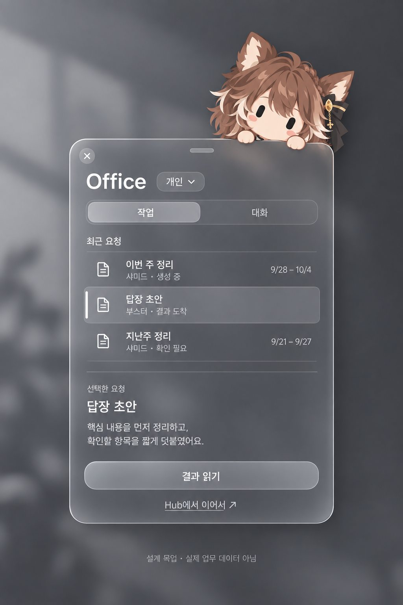
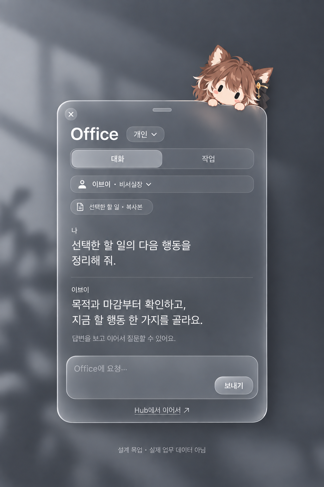

# 펫에서 Office 쓰기 — 목업 2개와 기능 기획 2안

기준일: 2026-10-03 · 상태: **검토용 제안 / 선택 전 / 미구현**

운영자 요청: 기존 펫에서 Office 작업을 띄우고, 이를 더 발전시킨 목업과 기능 기획을 각각 두 개씩 비교한다.

## 비교

아래 번호는 이번 채팅에서 이미지가 표시된 순서와 같다.

| | 1안 · 작업을 먼저 보는 창 | 2안 · 바로 묻고 이어가는 창 |
| --- | --- | --- |
| 중심 행동 | 기존 요청 선택 → 결과 읽기 | 담당자 선택 → 요청 → 후속 대화 |
| 첫 화면 | 최근 요청 세 행과 선택 결과 미리보기 | 한 대화와 작성란 |
| 잘 맞는 상황 | 여러 Office 요청의 상태·결과를 다시 확인 | 지금 하던 일에 대해 짧게 판단·초안·검토 |
| 기존 자산 | 영속 요청/receipt, 인증, 대화 Store | 기존 Office chat, 대화 UI, 초안/인증 Store |
| 추가 범위 | 최근 요청 요약 RPC/API, 목록·상세 | Office 진입과 읽음 정리, 선택 맥락 가져오기 |
| 작업 탭 | 저장된 주간 정리·고객 답장 요청 | 현재 대화에 가져온 할 일의 출처와 Hub 이동 |
| 실제 업무 반영 | Hub에서 명시적으로 진행 | Hub에서 명시적으로 진행 |
| 초기 개발 부담 | 비교적 큼: Hub·DB·Mac 호환 필요 | 비교적 작음: 기존 채팅 계약 재사용 가능 |

기존 기능을 빠르게 활용하려면 2안을 먼저 구현하는 방향을 권장한다. 저장된 요청을 모아보는 것이 우선이면 1안이 맞다. 2안을 먼저 만들고 이후 1안의 목록을 같은 작업 탭에 넣는 단계적 결합도 가능하다. 최종 선택은 아직 확정하지 않았다.

## 1안 목업과 기획

[기능 기획 A — 작업을 먼저 보는 창](../superpowers/specs/2026-10-03-pet-office-work-first-proposal.md)

목록은 업무 할 일이 아니라 Office 생성 요청이다. 생성 중·결과 도착·확인 필요를 구분하고, 결과를 읽는 행동이 실제 업무 완료나 반영을 뜻하지 않는다.

## 2안 목업과 기획

[기능 기획 B — 바로 묻고 이어가는 창](../superpowers/specs/2026-10-03-pet-office-conversation-first-proposal.md)

선택한 할 일의 복사본을 보면서 담당자에게 질문한다. 기존 일반 chat의 메모리 대화와 영속 Office 요청 receipt는 별도 계약으로 유지한다.

## 두 안의 공통 기준

- 기존 companion 창 하나에서 작업·대화·로그인 내용을 전환한다. 중복 빠른 입력 창을 추가하지 않는다.
- Mac의 clear glass와 시스템 글꼴을 유지한다. Windows Acrylic은 별도 플랫폼 설계·검증 대상이다.
- 배포 Hub 연결과 native 운영자 세션을 재사용한다. 새 API가 필요한 안은 서버 배포와 Mac 버전 호환을 함께 검증한다.
- Office는 판단·초안·검토만 한다. 자동 업무 생성·외부 전송·로컬 도구 실행을 추가하지 않는다.
- 인증 만료, HTTP 200/error, 실제 빈 결과, preview, 만료 본문, 늦은 응답을 각각 구분한다.
- 실제 펫 크기는 기존 72pt perch를 기준으로 유지한다. 생성 이미지의 캐릭터 비율·유리 굴절은 시각적 탐색이며 정확한 렌더링 수치가 아니다.

## 산출물과 검증 범위

이미지 두 개와 기획 두 개를 저장했다. 이미지의 예시 문구는 실제 업무 데이터가 아니고 앱 코드에 삽입되지 않았다. 내장 imagegen으로 각각 독립 생성했으며 [최종 프롬프트](../design-assets/pet-office-20261003/prompts.md)를 함께 보관했다.

참조로 실제 pet-brown.png를 첨부했다. 2안에는 1안 생성 이미지를 재질 참조로 추가했다. 이번 생성에는 실제 Hub/native 업무 화면 캡처를 첨부하지 않았다.

검증 범위는 이미지의 한글·구성·역할 경계, 문서 링크, 기존 API/테이블/Store와의 개발 범위 대조다. 제품 코드 변경이나 배포, 런타임 기능 검증을 완료했다는 의미는 아니다.
