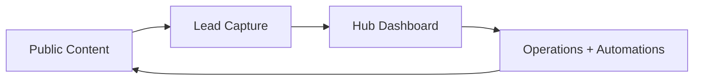

# Com_Moon Frontend Execution Plan

## 1. Current Truth

The repo already tells us the real situation:

- [`apps/web`](/Users/bigmac_moon/Desktop/Projects/moonlight_pro/apps/web) has a lightweight public landing skeleton.
- [`apps/hub`](/Users/bigmac_moon/Desktop/Projects/moonlight_pro/apps/hub) has an early dashboard and a card-news editor prototype.
- [`packages/ui`](/Users/bigmac_moon/Desktop/Projects/moonlight_pro/packages/ui) exists, but it is not yet a real shared design system.
- Both apps depend on Next 14, but there is no shared frontend foundation yet for tokens, layout, and reusable state patterns.
- `apps/hub` already uses utility-style class naming, but there is no visible shared styling setup yet to make that pattern reliable.
- Hub code already references Supabase tables like `operation_cases`, `leads`, and `content_items`, so UI should be organized around those real operating objects.

This is good news. The product shape is visible. The frontend just needs one opinionated operating plan.

## 2. Frontend Goal

Build one coherent experience with two jobs:

1. Public surface that converts trust into leads.
2. Private surface that converts signals into action.

The user outcome is simple:

- a visitor understands what Com_Moon does in under 30 seconds
- an operator sees what matters in under 5 seconds
- content, lead capture, and operating decisions feel like one loop

## 3. North Star UX

Think of Com_Moon as:

- a public editorial storefront
- connected to a private command desk

That means the frontend should feel less like "marketing site + admin" and more like "outer skin + inner control room".



## 4. Information Architecture

### Public Surface, `apps/web`

#### MVP Routes

- `/`
- `/insights`
- `/insights/[slug]`
- `/cases`
- `/contact`

#### Later Routes

- `/newsletter`
- `/about`
- `/resources`

### Private Surface, `apps/hub`

Detailed tab-by-tab product spec:

- [`docs/hub-tab-mvp-ui-spec.md`](/Users/bigmac_moon/Desktop/Projects/moonlight_pro/docs/hub-tab-mvp-ui-spec.md)

#### MVP Routes

- `/dashboard`
- `/leads`
- `/operations`
- `/content`
- `/automations`
- `/logs`

#### Later Routes

- `/settings`
- `/daily-brief`
- `/playbooks`

## 5. Page Intent By Route

### `/`

Job:
Explain the system fast, prove capability, and drive the next action.

Required blocks:

- Hero with sharp value proposition
- Proof strip with real outcomes or operating claims
- 3-pillar explanation of content, leads, operations
- Featured content or case section
- Lead capture CTA

### `/insights`

Job:
Turn Com_Moon thinking into trust assets.

Required blocks:

- Filterable article list
- Featured story slot
- Topic tags
- Newsletter or inquiry CTA

### `/cases`

Job:
Show applied work, not abstract positioning.

Required blocks:

- Case summary cards
- Before/after outcomes
- Service fit explanation
- Strong inquiry CTA

### `/contact`

Job:
Reduce friction and qualify inbound leads.

Required blocks:

- Short intro
- Contact form
- What to include guidance
- Expected reply rhythm

### `/dashboard`

Job:
Give the founder immediate operating clarity.

Required blocks:

- KPI strip
- today's priorities
- recent lead movement
- content pipeline status
- automation health
- recent errors or warnings

### `/leads`

Job:
Show who is warm, what changed, and what to do next.

Required blocks:

- Lead table or list
- Stage/status chips
- Source attribution
- Last touch timestamp
- Next action controls

### `/operations`

Job:
Track active work without making the screen feel like a bloated PM tool.

Required blocks:

- Case list
- Priority and risk flags
- Timeline of updates
- Owner/next milestone

### `/content`

Job:
Manage the publishing pipeline from idea to output.

Required blocks:

- Draft queue
- Publishing state
- Card-news editor
- Preview surface
- Distribution history

### `/automations`

Job:
Show whether the machine is running.

Required blocks:

- Automation cards
- Recent runs
- Success/failure status
- Webhook/event history
- Retry or inspect actions

### `/logs`

Job:
Make failure visible and fixable.

Required blocks:

- Error list
- Severity state
- Context payload summary
- Resolution status
- Link back to impacted area

## 6. Shared Component System

### Foundation Layer

- App shell
- Section shell
- Container
- Grid primitives
- Tokenized typography
- Surface/card variants
- Semantic color badges

### Input Layer

- Button
- Icon button
- Text input
- Search input
- Select
- Textarea
- Checkbox
- Command bar

### Data Layer

- KPI card
- Metric strip
- Timeline row
- Status chip
- Table
- Empty state
- Skeleton
- Toast

### Workflow Layer

- Lead card
- Operation card
- Automation run card
- Log row
- Split editor/preview
- Content draft card

## 7. Technical Frontend Decisions

### Styling

Adopt one system across both apps:

- CSS variables for design tokens
- Tailwind utilities for composition
- component-level variants inside [`packages/ui`](/Users/bigmac_moon/Desktop/Projects/moonlight_pro/packages/ui)

Reason:

- `apps/hub` already reads like utility-class UI
- `apps/web` already has strong visual tokens in CSS
- combining tokens plus utilities gives speed without losing brand control

### Rendering

- Use Server Components by default
- Use Client Components only for live dashboards, editors, filters, and optimistic interactions
- Move data fetching to server boundaries where possible

### Fonts

- Load brand fonts once at app shell level
- Share the same font contract across web and hub

### State

- URL state for filters, tabs, and search where it helps shareability
- local component state for lightweight editor interactions
- Supabase-backed server fetch for core dashboard data

## 8. Repo Shape To Aim For

```text
packages/ui/
  tokens/
  primitives/
  patterns/
  shells/

apps/web/app/
  (marketing)/
    page.tsx
    insights/
    cases/
    contact/

apps/hub/app/
  (os)/
    dashboard/
    leads/
    operations/
    content/
    automations/
    logs/
```

## 9. Build Order

### Phase 0. Frontend Foundation

- stabilize app shells for `web` and `hub`
- create design tokens
- wire typography
- stand up real shared primitives in `packages/ui`
- define empty/loading/error states before page expansion

Definition of done:

- both apps share colors, type, spacing, and base components
- no route uses ad hoc spacing or one-off surface styling

### Phase 1. Public Conversion Surface

- finish homepage information hierarchy
- build insights list/detail
- build cases page
- ship contact flow

Definition of done:

- public surface can explain value, publish proof, and capture leads

### Phase 2. Hub Core OS

- rebuild dashboard with real operator hierarchy
- ship leads view
- ship operations view
- standardize summary cards, tables, chips, and timelines

Definition of done:

- operator can open the hub and know what needs attention immediately

### Phase 3. Content And Automation Loop

- promote card-news editor into the content area
- add distribution and publishing state
- build automation run visibility
- expose log inspection views

Definition of done:

- content production and automation health are visible from one flow

### Phase 4. Polish And Mobile Hardening

- responsive cleanup
- keyboard/focus QA
- motion polish
- PWA checks
- performance pass

Definition of done:

- public and hub flows both feel intentional on phone and desktop

## 10. Sprint-Level Full-Throttle Plan

### Sprint 1

- finalize design tokens
- finalize route map
- build shared shells and primitives

### Sprint 2

- complete public homepage
- complete insights index/detail
- complete contact capture flow

### Sprint 3

- complete dashboard
- complete leads
- complete operations

### Sprint 4

- complete content workspace
- complete automations
- complete logs

### Sprint 5

- responsive polish
- accessibility pass
- performance optimization
- launch checklist

## 11. Quality Bar

Every shipped route needs:

- desktop and mobile layouts
- loading state
- empty state
- error state
- clear primary action
- keyboard-usable form controls

If a page only looks good with seeded data, it is not done.

## 12. Risks To Control Early

1. Visual drift between `web` and `hub`.
2. Too many one-off cards before `packages/ui` is real.
3. Dashboard density increasing faster than information clarity.
4. Content tools shipping without a clear publish-state model.
5. Error logs becoming a raw dump instead of an operator tool.

## 13. Immediate Next Build Tasks

If implementation starts right after this plan, the first tickets should be:

1. Create shared tokens and typography contract in [`packages/ui`](/Users/bigmac_moon/Desktop/Projects/moonlight_pro/packages/ui).
2. Build `AppShell`, `SectionCard`, `Button`, `Badge`, `Input`, `EmptyState`, `Skeleton`.
3. Refactor [`apps/web/app/page.tsx`](/Users/bigmac_moon/Desktop/Projects/moonlight_pro/apps/web/app/page.tsx) to match the final homepage section order.
4. Rebuild [`apps/hub/app/dashboard/page.tsx`](/Users/bigmac_moon/Desktop/Projects/moonlight_pro/apps/hub/app/dashboard/page.tsx) around operator priority, not raw counts alone.
5. Turn [`apps/hub/app/dashboard/card-news/page.tsx`](/Users/bigmac_moon/Desktop/Projects/moonlight_pro/apps/hub/app/dashboard/card-news/page.tsx) into a proper content workspace route under `/content`.

## 14. Final Read

The product does not need more screens first.

It needs one shared frontend language, then a ruthless route order:

public trust, lead capture, operator clarity, automation visibility.

That sequence is the whole game.
