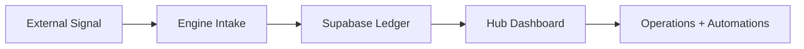

# Com_Moon Frontend Execution Plan

> Status: historical pre-detach plan. The active frontend is now Hub only; public web routes were removed from the workspace to keep execution focused.

## 1. Current Truth

The repo already tells us the real situation:

- The former public landing skeleton has been detached from the active workspace.
- [`apps/hub`](/Users/bigmac_moon/Desktop/Projects/moonlight_pro/apps/hub) has an early dashboard and a card-news editor prototype.
- [`packages/ui`](/Users/bigmac_moon/Desktop/Projects/moonlight_pro/packages/ui) exists, but it is not yet a real shared design system.
- Both apps depend on Next 14, but there is no shared frontend foundation yet for tokens, layout, and reusable state patterns.
- `apps/hub` already uses utility-style class naming, but there is no visible shared styling setup yet to make that pattern reliable.
- Hub code already references Supabase tables like `operation_cases`, `leads`, and `content_items`, so UI should be organized around those real operating objects.

This is good news. The product shape is visible. The frontend just needs one opinionated operating plan.

## 2. Frontend Goal

Build one coherent active experience:

1. Private surface that converts signals into action.

The user outcome is simple:

- an operator sees what matters in under 5 seconds
- content, lead capture, and operating decisions feel like one loop

## 3. North Star UX

Think of Com_Moon as:

- a private command desk
- connected to an intake and execution engine

Reference alignment for the current design pass:

- [`Claude x Notion hybrid plan`](/Users/bigmac_moon/Desktop/Projects/moonlight_pro/docs/claude-notion-hybrid-ui-plan.md)

That reference plan should guide taste decisions while this document keeps execution order and route scope grounded in the real repo.

That means the frontend should feel like an inner control room, not a generic admin dashboard.



## 4. Information Architecture

### Detached Public Surface

#### MVP Routes

- `/`
- `/insights`
- `/insights/[slug]`
- `/cases`
- `/contact`

#### Later Routes

- `/newsletter`
- `/about`
- `/resources`

### Private Surface, `apps/hub`

Detailed tab-by-tab product spec:

- [`docs/hub-tab-mvp-ui-spec.md`](/Users/bigmac_moon/Desktop/Projects/moonlight_pro/docs/hub-tab-mvp-ui-spec.md)
- GitHub-backed Work OS MVP mockup and wireframe:
  - [`docs/github-workos-mvp-mockup.md`](/Users/bigmac_moon/Desktop/Projects/moonlight_pro/docs/github-workos-mvp-mockup.md)
- Hub design priority todo:
  - [`docs/hub-design-priority-todo.md`](/Users/bigmac_moon/Desktop/Projects/moonlight_pro/docs/hub-design-priority-todo.md)

#### Canonical Operator IA

- `/dashboard`
- `/dashboard/work`
- `/dashboard/revenue`
- `/dashboard/content`
- `/dashboard/automations`
- `/dashboard/evolution`

#### Utility And Transitional Routes

- `/dashboard/daily-brief`
- `/dashboard/playbooks`
- `/dashboard/command-center`
- `/dashboard/command` as a compatibility alias while the utility layer is consolidated

#### Later Routes

- detail drawer overlays
- saved filtered views
- command palette global shortcut

## 5. Page Intent By Route

### `/`

Job:
Explain the system fast, prove capability, and drive the next action.

Required blocks:

- Hero with sharp value proposition
- Proof strip with real outcomes or operating claims
- 3-pillar explanation of content, leads, operations
- Featured content or case section
- Lead capture CTA

### `/insights`

Job:
Turn Com_Moon thinking into trust assets.

Required blocks:

- Filterable article list
- Featured story slot
- Topic tags
- Newsletter or inquiry CTA

### `/cases`

Job:
Show applied work, not abstract positioning.

Required blocks:

- Case summary cards
- Before/after outcomes
- Service fit explanation
- Strong inquiry CTA

### `/contact`

Job:
Reduce friction and qualify inbound leads.

Required blocks:

- Short intro
- Contact form
- What to include guidance
- Expected reply rhythm

### `/dashboard`

Job:
Give the founder immediate operating clarity.

Required blocks:

- KPI strip
- today's priorities
- recent lead movement
- content pipeline status
- automation health
- recent errors or warnings

### `/dashboard/daily-brief`

Job:
Condense the day into one operator brief before context switching starts.

Required blocks:

- KPI strip for today
- top 3 actions
- approvals waiting
- risk watch
- cross-lane movement feed
- day rhythm prompts

### `/dashboard/playbooks`

Job:
Turn repeatable work into explicit operating recipes.

Required blocks:

- playbook categories
- trigger conditions
- step-by-step run cards
- owner and automation hook
- what to run now queue
- recent usage or last run signal

### `/dashboard/command-center`

Job:
Give the operator one fast utility layer for search, dispatch, smoke tests, and recent actions.

Required blocks:

- quick run actions
- recent command activity
- reusable templates
- snippets and payload examples
- smoke test launchers
- handoff links to automations, content, or work lanes

### `/dashboard/revenue`

Job:
Show who is warm, what changed, and what to do next.

Required blocks:

- Lead table or list
- Stage/status chips
- Source attribution
- Last touch timestamp
- Next action controls

### `/dashboard/work`

Job:
Track active work without making the screen feel like a bloated PM tool.

Required blocks:

- Case list
- Priority and risk flags
- Timeline of updates
- Owner/next milestone

### `/dashboard/content`

Job:
Manage the publishing pipeline from idea to output.

Required blocks:

- `Overview` with KPI, attention, and next move
- `Queue` for idea/draft/review management
- `Studio` for card-news creation and handoff
- `Assets` for reusable outputs and source material
- `Publish` for distribution history and failure watch

Status (2026-04-12):
- `Queue` shipped with idea/draft/review pipeline lanes, an owner/due/next-action **roster** below the lanes, and a `?stage=` filter chip row. Stage chips link back to the studio with the brand context preserved.
- `Studio` shipped with split editor + slide-by-slide preview (parses `## 슬라이드 N` headers into separate cards) + Handoff section that links into `/dashboard/automations/email` and `/dashboard/content/publish`.

### `/dashboard/automations`

Job:
Show whether the machine is running.

Required blocks:

- Automation cards
- Recent runs
- Success/failure status
- Webhook/event history
- Retry or inspect actions

Sub-routes:

- `/dashboard/automations/runs` — execution pulse
- `/dashboard/automations/webhooks` — endpoint catalog
- `/dashboard/automations/integrations` — connected providers
- `/dashboard/automations/email` — email automation surface

### `/dashboard/automations/email`

Job:
Compose and route operator email without slipping into a generic marketing tool.

Required blocks:

- Channel posture cards (Resend / n8n / Gmail)
- Audience segment strip (전체 / Warm / Newsletter / Clients / Hand-picked)
- Email composer (split editor + sticky preview)
  - Template selector that auto-snaps to the active segment audience
  - Variable chips (`{{lead_name}}` / `{{brand}}` / `{{week_label}}` / `{{cta_label}}` / `{{signature}}`) — click-to-insert at cursor
  - Block library (인사 / 후속 본문 / 주간 브리프 / CTA / 서명) — click-to-insert at cursor
  - Live preview that resolves variables against the segment sample context
  - Action row: `초안 리셋` / `초안 저장` / `Dry-run` / `발송 예약`
- Template catalog (filtered by selected segment audience)
- Send queue (filtered by selected segment audience)
- Recent sends timeline
- Operator guardrails

Status (2026-04-12):
- UI surface shipped end-to-end with provider-agnostic seed data.
- Composer is a client component (`apps/hub/components/forms/email-composer.jsx`) and persists no state across reloads.
- Live wiring (`email_templates` / `email_queue` / `email_sends` Supabase tables + `apps/engine/lib/email/<provider>.ts`) still pending.

### `/dashboard/work/plan`

Job:
Compare the master-roadmap plan against the current operating reality so the operator can see drift the moment it appears.

Required blocks:

- KPI strip — phases on track, projects drifting, average drift days, critical risk count
- Phase tracker grid — each phase card shows a dual gauge (filled bar = actual, white tick = planned %), variance chip, planned vs expected end dates, scope, operator note
- Project scorecard table — name, owner, dual gauge, planned vs expected dates, variance chip, next milestone, blocker
- Milestone variance timeline — sorted by largest delay first
- Drift watch list — each item carries a `next move` and a jump link to the relevant lane

Status (2026-04-12):
- UI surface shipped at `/dashboard/work/plan` with seed data sourced from `docs/master-roadmap.md` + `docs/master-plan.md`.
- The plan progress bar uses a single primitive (`PlanProgressBar`) so phase cards and the project scorecard render the same gauge shape.
- Live wiring waits for a `plan_baselines` view (or join) that can supply planned vs actual milestone dates per project.

### `/dashboard/evolution/logs`

Job:
Make failure visible and fixable.

Required blocks:

- Error list
- Severity state
- Context payload summary
- Resolution status
- Link back to impacted area

## 6. Shared Component System

### Foundation Layer

- App shell
- Section shell
- Container
- Grid primitives
- Tokenized typography
- Surface/card variants
- Semantic color badges

### Input Layer

- Button
- Icon button
- Text input
- Search input
- Select
- Textarea
- Checkbox
- Command bar

### Data Layer

- KPI card
- Metric strip
- Timeline row
- Status chip
- Table
- Empty state
- Skeleton
- Toast

### Workflow Layer

- Lead card
- Operation card
- Automation run card
- Log row
- Split editor/preview
- Content draft card

## 7. Technical Frontend Decisions

### Styling

Adopt one system across both apps:

- CSS variables for design tokens
- Tailwind utilities for composition
- component-level variants inside [`packages/ui`](/Users/bigmac_moon/Desktop/Projects/moonlight_pro/packages/ui)

Reason:

- `apps/hub` already reads like utility-class UI
- the detached public surface already had strong visual-token exploration
- combining tokens plus utilities gives speed without losing brand control

### Rendering

- Use Server Components by default
- Use Client Components only for live dashboards, editors, filters, and optimistic interactions
- Move data fetching to server boundaries where possible

### Fonts

- Load brand fonts once at app shell level
- Share the same font contract across web and hub

### State

- URL state for filters, tabs, and search where it helps shareability
- local component state for lightweight editor interactions
- Supabase-backed server fetch for core dashboard data

## 8. Repo Shape To Aim For

```text
packages/ui/
  tokens/
  primitives/
  patterns/
  shells/

detached public app/
  (marketing)/
    page.tsx
    insights/
    cases/
    contact/

apps/hub/app/
  (os)/
    dashboard/
      page.tsx
      work/
      revenue/
      content/
      automations/
      evolution/
      daily-brief/
      playbooks/
      command-center/
```

## 9. Build Order

### Phase 0. Frontend Foundation

- stabilize app shells for `web` and `hub`
- create design tokens
- wire typography
- stand up real shared primitives in `packages/ui`
- define empty/loading/error states before page expansion

Definition of done:

- both apps share colors, type, spacing, and base components
- no route uses ad hoc spacing or one-off surface styling

### Phase 1. Public Conversion Surface

- finish homepage information hierarchy
- build insights list/detail
- build cases page
- ship contact flow

Definition of done:

- public surface can explain value, publish proof, and capture leads

### Phase 2. Hub Core OS

- rebuild dashboard with real operator hierarchy
- ship revenue view
- ship Work OS view
- standardize summary cards, tables, chips, and timelines

Definition of done:

- operator can open the hub and know what needs attention immediately

### Phase 3. Content And Automation Loop

- treat `/dashboard/card-news` as an alias that resolves into `Content > Studio`
- add distribution and publishing state
- build automation run visibility
- expose evolution and log inspection views
- ship the email automation surface (`/dashboard/automations/email`) with composer + segment + variable / block UX
- ship the plan-vs-current status board (`/dashboard/work/plan`) so the operating loop can see drift before it slips

Definition of done:

- content production and automation health are visible from one flow
- email composition and audience routing are reachable from one screen without slipping into a generic marketing tool
- the operator can open `/dashboard/work/plan` and see where the master roadmap is drifting in under five seconds

Status (2026-04-12):
- Content Studio + Queue UI slices complete with seed data
- Email automation surface + composer client component complete with seed data
- Plan tracker dashboard complete with seed data
- Provider adapters (Resend / n8n / Gmail) and live `plan_baselines` reads still pending

### Phase 4. Polish And Mobile Hardening

- responsive cleanup
- keyboard/focus QA
- motion polish
- PWA checks
- performance pass

Definition of done:

- public and hub flows both feel intentional on phone and desktop

## 10. Sprint-Level Full-Throttle Plan

### Sprint 1

- finalize design tokens
- finalize route map
- build shared shells and primitives

### Sprint 2

- complete public homepage
- complete insights index/detail
- complete contact capture flow

### Sprint 3

- complete dashboard
- complete revenue
- complete Work OS

### Sprint 4

- complete content workspace
- complete automations
- complete evolution views

### Sprint 5

- responsive polish
- accessibility pass
- performance optimization
- launch checklist

## 11. Quality Bar

Every shipped route needs:

- desktop and mobile layouts
- loading state
- empty state
- error state
- clear primary action
- keyboard-usable form controls

If a page only looks good with seeded data, it is not done.

## 12. Risks To Control Early

1. Visual drift between `web` and `hub`.
2. Too many one-off cards before `packages/ui` is real.
3. Dashboard density increasing faster than information clarity.
4. Content tools shipping without a clear publish-state model.
5. Error logs becoming a raw dump instead of an operator tool.

## 13. Immediate Next Build Tasks

If implementation starts right after this plan, the first tickets should be:

1. Create shared tokens and typography contract in [`packages/ui`](/Users/bigmac_moon/Desktop/Projects/moonlight_pro/packages/ui).
2. Build `AppShell`, `SectionCard`, `Button`, `Badge`, `Input`, `EmptyState`, `Skeleton`.
3. Keep public homepage work out of the active workspace until the Hub/Engine loop is stable.
4. Rebuild [`apps/hub/app/dashboard/page.tsx`](/Users/bigmac_moon/Desktop/Projects/moonlight_pro/apps/hub/app/dashboard/page.tsx) around operator priority, not raw counts alone.
5. Keep [`apps/hub/app/dashboard/card-news/page.tsx`](/Users/bigmac_moon/Desktop/Projects/moonlight_pro/apps/hub/app/dashboard/card-news/page.tsx) as a compatibility redirect into `Content > Studio`, then move shared card-news rules into `packages/content-manager`.

## 14. Hub Design Priority Todo

Current design work should follow this order:

1. `Revenue`: split operator thinking into `Individual` and `Company` audience modes.
2. `Content`: deepen brand-specific operating rules, reference panels, and publishing rhythm.
3. `Overview`: tighten today-first decision blocks, approvals, and next-three-actions.
4. `Detail Drawer`: create a shared right-side detail surface across lanes.
5. `Automations`: design failure triage, retry flow, and human handoff rules.
6. `Evolution`: turn logs/issues into a visible improvement loop.
7. `Daily Brief / Playbooks / Command Center`: harden the utility surfaces without promoting them into new top-level tabs.

Use [`docs/hub-design-priority-todo.md`](/Users/bigmac_moon/Desktop/Projects/moonlight_pro/docs/hub-design-priority-todo.md) as the execution-facing checklist.

## 15. Final Read

The product does not need more screens first.

It needs one shared frontend language, then a ruthless route order:

public trust, lead capture, operator clarity, automation visibility.

That sequence is the whole game.
