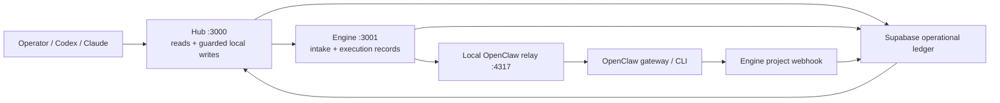

# Integration Control Plane 상속 계약

> 상태: ACTIVE INHERITANCE CONTRACT
>
> 검증 기준: 2026-07-15 KST 로컬 실행 상태와 현재 코드
>
> 목적: OAuth, webhook, OpenClaw, MCP, 로컬 서비스 후속 작업이 이미 확보한 경계와 정직한 상태 표현을 깨지 않게 한다.

이 문서는 새 통합을 설계하는 문서가 아니다. 아래 두 문서와 실제 로컬 검증 결과에서, 앞으로 반드시 보존해야 할 계약만 모은다.

- [Integration Control Plane Cleanup Plan](superpowers/plans/2026-07-15-integration-control-plane-cleanup.md)
- [Integration Inventory](integration-inventory.md)

시크릿 값, OAuth 토큰, 계정 이메일, 비공개 캘린더 URL은 이 문서와 로그에 남기지 않는다.

## 확정

### 1. 실행 경계

- **Hub**는 운영자 read surface와 승인된 로컬 write surface다. 외부 실행을 직접 가장하지 않고 Engine에 전달하며, 미연결 상태에서는 `preview` 또는 명시적 오류를 반환한다.
- **Engine**은 외부 webhook intake, OpenClaw outbound sync, PMS/content command validation·persistence, 실행·수신 이력을 맡는다. `webhook_events`, `project_updates`, `sync_runs`와 재조회된 durable project/task/content가 실행 증거다.
- **OpenClaw relay**는 로컬 transport adapter다. Engine snapshot을 OpenClaw CLI로 넘길 뿐 원장이 아니며, 독자적으로 프로젝트 상태를 확정하지 않는다.
- **Supabase**가 공유 운영 원장이다. OpenClaw가 만든 진행 정보도 Engine webhook을 거쳐 원장에 기록된 뒤 Hub가 읽는다.
- OpenClaw의 반환 경로는 `POST /api/webhook/project/openclaw`이다. Hub나 relay에 별도 반환 원장을 만들지 않는다.

### 2. 네 시크릿의 책임 분리

| 환경변수 | 한 가지 책임 | 공유 범위 |
|---|---|---|
| `COM_MOON_OAUTH_STATE_SECRET` | OAuth state 서명·검증 | Hub OAuth 코드만 |
| `COM_MOON_HUB_WRITE_SECRET` | Hub write route와 MCP write tool 보호 | Hub와 해당 로컬 MCP 프로세스 |
| `COM_MOON_SHARED_WEBHOOK_SECRET` | Hub↔Engine 호출 및 Engine inbound webhook 인증 | Hub와 Engine에서만 같은 값 |
| `OPENCLAW_SYNC_SECRET` | Engine→OpenClaw relay 요청 인증 | Engine과 relay |

- 네 값은 모두 별도 생성한다. 한 시크릿이 없을 때 다른 시크릿으로 fallback하지 않는다.
- 동일해야 하는 것은 Hub와 Engine이 사용하는 `COM_MOON_SHARED_WEBHOOK_SECRET` 한 쌍뿐이다.
- 원격 production Hub write는 `COM_MOON_HUB_WRITE_SECRET`를 요구한다. 로컬 production browser는 secret을 노출하지 않고 loopback(`localhost`, `127.0.0.1`, `::1`) same-origin 요청만 허용한다.
- readiness에는 설정 여부와 책임 간 중복 여부만 노출한다. 값이나 복원 가능한 fingerprint는 노출하지 않는다.
- 2026-07-15 로컬 확인에서는 네 시크릿이 모두 설정되어 있고 책임별 값이 분리되어 있었다. Hub와 Engine의 shared webhook 값도 일치했다.

### 3. Google provider와 캘린더 위상

- Google OAuth는 `GOOGLE_OAUTH_ENABLED_PROVIDERS`의 명시적 allowlist를 통과한 provider만 configured로 본다.
- 현재 로컬 allowlist는 **Calendar만 활성화**한다. Gmail과 Sheets는 같은 OAuth client ID가 있더라도 callback URI와 scope를 각각 검증하기 전까지 disabled다.
- Moonlight Hub가 읽고 쓰는 **회사/ClassIn Calendar**와 Codex의 별도 connector가 보는 **개인 Calendar**는 서로 다른 연결이다. 계정, source, 결과를 합치거나 같은 인증 상태로 추론하지 않는다.
- Calendar 응답은 `source: "oauth" | "ical"`과 `readOnly`를 보존한다. UI, MCP, 후속 API도 이 구분을 지우지 않는다.
- iCal은 OAuth connection 또는 access token이 없을 때만 쓰는 읽기 전용 fallback이다. OAuth API 오류를 iCal 성공으로 가리지 않으며 OAuth 결과와 iCal 결과를 한 응답에 merge하지 않는다.
- iCal fetch는 HTTPS Google Calendar feed, bounded time window, 크기 제한, `no-store` 조건을 유지한다. 비공개 feed URL은 응답·로그·문서에 포함하지 않는다.
- 2026-07-15 로컬 bounded read는 회사 Calendar에서 `status=live`, `source=oauth`, `readOnly=false`로 성공했다. iCal도 설정되어 있지만 이 성공 경로에서는 사용되지 않았다.

### 4. 로컬 상시 서비스

| launchd label | 역할 | 로컬 포트 | 2026-07-15 확인 |
|---|---|---:|---|
| `com.moonlight.engine` | Engine Next.js API | 3001 | plist 존재, `RunAtLoad`/`KeepAlive`, running |
| `com.moonlight.openclaw-relay` | Engine snapshot→OpenClaw CLI relay | 4317 | plist 존재, `RunAtLoad`/`KeepAlive`, running |

- plist는 `~/Library/LaunchAgents`의 local-only 운영 파일이다. 저장소에 시크릿을 복사하지 않는다.
- 확인된 plist의 `EnvironmentVariables`에는 시크릿 값이 직접 들어 있지 않았다. Engine은 app-local env 로딩 경계를, relay는 local env file 로딩 경계를 유지한다.
- Hub, Engine, relay, OpenClaw gateway는 각각 독립적으로 probe한다. 하나의 URL 설정 여부로 다른 서비스의 생존을 추론하지 않는다.
- 2026-07-15 확인 시 Hub `200/ok`, Engine `200/ok`, relay `200/ok`, OpenClaw gateway HTTP 200이었다. Hub는 Engine과 relay를 각각 `configured=true`, `reachable=true`, `status=live`로 보고했다.

### 5. webhook 인증과 멱등성

- Generic project route와 provider alias route는 `COM_MOON_SHARED_WEBHOOK_SECRET`를 header 또는 Bearer token으로 검증한다.
- 시크릿이 없으면 기본은 거부다. 인증 없는 webhook은 non-production에서 `COM_MOON_ALLOW_OPEN_WEBHOOKS=true`를 명시한 로컬 smoke 환경에만 허용한다.
- 멱등성 우선순위는 provider event ID, `Idempotency-Key`, stable payload digest다. 최종 `provider_event_id`는 source와 함께 정규화한다.
- DB는 `(workspace_id, source, provider_event_id)` unique index를 유지한다. 중복 이벤트는 새 `project_updates`를 만들지 않고 `status=duplicate`로 응답한다.
- 결과 상태 `accepted`, `partial`, `duplicate`, `failed`를 하나의 성공 상태로 뭉개지 않는다.
- 내부 PMS command는 `POST /api/pms/command`에서 shared secret을 검증한다. create는 client-generated UUID 재시도 시 기존 entity를 반환하고, update는 항상 `id + workspace_id` filter를 사용한다.
- 콘텐츠 create/update/handoff/campaign도 Hub에서 Supabase로 직접 쓰지 않는다. Hub가 record를 조립하고 Engine의 `POST /api/content/command`가 shared secret, workspace·관계 ID, 중복 재시도를 검증한 뒤 저장한다. item 이후 variant 저장이 실패하면 새 item을 롤백하고, publish log 이후 asset 저장 실패도 새 log를 롤백한다.

### 6. Codex/Claude 로컬 MCP

- Moonlight MCP는 **stdio 전용 로컬 child process**다. 원격 HTTP/SSE connector가 아니다.
- Codex local config와 Claude Code project `.mcp.json`은 모두 같은 `packages/mcp-server/src/index.js`를 실행하며 Hub의 `.env.local`을 process start 시 읽는다.
- 두 등록 모두 환경변수 값을 config에 직접 embed하지 않는다. `.mcp.json`은 local-only이며 Git에 포함하지 않는다.
- read tool은 Hub route의 `live`/`preview`/`error` 의미를 그대로 전달한다. write tool은 `COM_MOON_HUB_WRITE_SECRET`가 없으면 요청 전에 거부한다.
- 현재 등록 surface에는 projects, tasks, task creation, revenue, content queue, calendar, work orders, agents, daily brief가 포함된다.
- 2026-07-15 Claude Code에서 project MCP를 승인했고 `moonlight`가 `Connected`로 전환됐다. Claude의 `list_tasks` live read는 6건을 반환했다. SDK `create_task` smoke도 저장→Hub 재조회→임시 row 삭제까지 성공했다.
- 같은 날 02:15 KST 새 stdio SDK 세션에서도 13개 도구 discovery, `list_tasks`의 `live/supabase` 6건, `create_task`의 `saved`, 재조회, 직접 정리 후 6건 복구와 residue 0을 다시 확인했다.
- Claude Desktop config에도 같은 process가 등록되어 있지만 Desktop 앱 lifecycle의 재시작/도구 발견은 Claude Code 검증과 별개다.

### 7. 상태 언어

통합 상태는 아래 축을 섞지 않는다.

| 축 | 의미 | 증거 |
|---|---|---|
| `configured` | 필요한 URL·키·provider enable flag가 존재 | 설정 검사 |
| `reachable` | bounded network probe가 현재 성공 | health probe 시각과 결과 |
| `authenticated` | provider가 자격증명을 실제로 받아 요청을 처리 | 성공한 provider API call 또는 검증된 connection |
| `snapshot` | 특정 시각에 가져온 사본 | source, imported/synced timestamp, row count |

- `configured=true`는 `reachable=true`나 `authenticated=true`를 뜻하지 않는다.
- optional integration이 unreachable이면 Hub 전체를 실패로 만들지 않고 그 integration만 `degraded`로 표시한다.
- live, degraded, disabled, preview, snapshot을 구분한다. stale snapshot을 live connection처럼 표시하지 않는다.
- 가능하면 `account`는 redacted label로, 성공 이력은 `lastSuccessfulSyncAt`로 노출한다. 값이 없으면 추정하지 않고 `unknown` 또는 `null`로 둔다.

### 8. OpenClaw 로컬 보안·보존 경계

- Telegram inbound는 `groupPolicy=allowlist`다. 2026-07-15 확인 기준 활성·도달 가능한 그룹 4개만 등록하고 모든 그룹에 mention을 요구하며, `groupAllowFrom`은 운영자 Telegram ID 1개만 허용한다. 이미 탈퇴한 그룹은 목록에서 제거했다.
- Telegram native command menu는 148개가 플랫폼 한도 100개를 넘어 임의로 잘리고 있었으므로 `channels.telegram.commands.native=false`로 비활성화했다. `/new`, `/reset` 같은 text command 처리는 별개이며 유지한다.
- OpenClaw 정적 credential 6개(Telegram 1, Slack 2, gateway 1, Brave 1, Google model key 1)는 macOS Keychain-backed exec SecretRef로 이동했다. `openclaw secrets audit --allow-exec`에서 6/6 해석, plaintext 0, unresolved 0, shadowed 0을 확인했다.
- OpenAI Codex OAuth profile은 회전형 OAuth 자격증명이므로 OpenClaw SecretRef 명세의 static-secret migration 대상이 아니다. 이를 plaintext static secret과 같은 방식으로 이동하거나 삭제하지 않는다.
- 평문 credential이 남아 있던 `openclaw.json.bak*` 5개는 SecretRef 전환·reload·채널 probe 뒤 제거했다. 현재 남은 `cron/jobs.json.bak`은 credential backup이 아니다.
- 메인 session은 1,030,410 tokens/200,000 context로 과적재되어 공식 `sessions.reset`으로 새 session ID를 발급했다. 원문 105MB는 `.reset.*` archive로 보존되고 활성 session은 0 tokens다.
- session maintenance는 `enforce`, `pruneAfter=180d`, `maxEntries=500`, `maxDiskBytes=500mb`, `highWaterBytes=400mb`다. 원문이 이미 없던 session index 1개만 제거했고, 현재 50 entries와 오래된 채널 원문은 보존했다.
- Gateway LaunchAgent는 Homebrew Node 24.18.0의 고정 경로를 사용한다. NVM version path 의존을 제거한 뒤 supervisor config audit, RPC, Telegram, Slack, cron probe가 모두 성공했다.
- `security audit --deep`의 critical은 2건에서 0건으로 줄었다. 남은 warning 2건은 loopback gateway의 trusted proxy 미설정과 personal-assistant trust model의 multi-user heuristic이다. gateway를 reverse proxy에 공개하지 않는 동안 첫 경고는 적용 대상이 아니며, 두 번째는 단일 운영자 sender allowlist를 유지하는 조건으로 관찰한다.
- `.agents/skills/superpowers`가 `.codex/superpowers/skills`를 가리키는 cross-root symlink는 Codex 전용 분리다. OpenClaw는 이를 경고와 함께 건너뛰며, OpenClaw runtime skill로 복제하거나 symlink를 제거하지 않는다.

### 9. 2026-07-15 로컬 증거 스냅샷

| 항목 | 확인 결과 |
|---|---|
| Hub/Supabase | Hub 200/ok, Supabase reachable |
| Hydrated Hub UI | 표준 local origin `http://localhost:3000`에서 Daily Brief 6/6 ledger live·7 signals, PMS 4 project/6 task/오늘 2/blocked 1, 세 ClassIn lane, Projects·Revenue Leads 화면을 확인 |
| Engine/OpenClaw | Engine, relay, gateway reachable; relay는 sync mode |
| Secret topology | 4/4 configured, separated; Hub↔Engine shared secret match |
| Google gate | Calendar enabled/configured, Gmail·Sheets disabled |
| Calendar auth | 2026-07-15~07-31 bounded OAuth read 성공, 11 events, writable source, redacted primary identity 저장 |
| iCal | configured, 현재 OAuth 성공 때문에 fallback 미사용 |
| MCP | Codex enabled, Claude Code Connected. 새 SDK 세션에서 13 tools discovery, live task 6건 read, create/read-back/delete 성공; 임시 row 0건. Desktop config는 등록됐으나 앱 재시작 확인은 별도 |
| Signed webhook | 무인증 401, shared-secret 요청 202/accepted, 같은 idempotency key 재시도 200/duplicate, `webhook_events`·`project_updates` read-back 후 삭제 residue 0 |
| PMS write | Hub BFF→Engine command→Supabase create/update/read-back 성공. 임시 project/task 삭제 후 기존 4 project·6 task 복구 |
| Content write | Hub BFF→Engine content command→Supabase create/duplicate retry/update/read-back 성공. 임시 item/variant 삭제 후 기존 3 items 복구 |
| eeoCRM-derived ledger | Supabase 총 119 leads 중 117 eeoCRM snapshot, 문준혁 exact-owner 16건; live eeoCRM 연결 증거는 아님 |
| Credential hygiene | 동일 해시 OAuth client 복사본 2개를 `0600` 격리하고 OpenClaw inbound 원본 제거. inbound credential 0개, 별도 retained client `0600`. OpenClaw static secret은 Keychain SecretRef 6개, plaintext/unresolved 0개 |
| OpenClaw runtime | Homebrew Node 24.18.0 고정 경로, gateway supervisor audit 통과, Telegram/Slack probe 통과, security critical 0, main session 0/200k, session store 50 entries |
| OpenClaw cron | 평일 09:30 KST announce·실패 알림 설정. Telegram credential probe 성공, 대상 supergroup 조회 성공, bot administrator. 수정 후 첫 scheduled delivery는 아직 미실행 |
| 계약 테스트 | readiness, Hub write guard, PMS command/idempotency, iCal fallback, MCP, webhook contract 전체 통과 |

## 주의

- 계획 문서의 “signed webhook”은 현재 구현에서 shared-secret-authenticated request를 뜻한다. 현재 계약은 request body HMAC signature가 아니다. HMAC/재전송 방지 timestamp가 필요하다면 별도 계약으로 설계해야 한다.
- relay의 HTTP 성공은 relay가 요청을 수락·처리했다는 뜻이다. 비동기 모드를 다시 사용할 경우 OpenClaw child process의 최종 성공과 최초 queue 수락을 분리 기록해야 한다.
- launchd가 현재 running이라는 사실은 실제 재부팅 후 자동 복구 smoke를 대신하지 않는다. plist 변경 뒤에는 `kickstart`와 재부팅 후 probe를 각각 남긴다.
- Hub health는 현재 configured/reachable를 잘 분리하지만 모든 provider에 `authenticated`, redacted `account`, `lastSuccessfulSyncAt`를 일관되게 제공하지는 않는다. 후속 작업은 configured만 보고 “연결 완료”라고 쓰지 않는다.
- Calendar의 회사/개인 구분은 연결 경계다. 일정 제목·참석자·개인 계정 이메일을 readiness나 공용 로그에 넣지 않는다.
- MCP write는 로컬 프로세스라는 이유만으로 무인 승인하지 않는다. Hub write guard와 tool-level write-secret check를 모두 유지한다.
- eeoCRM 숫자는 변할 수 있는 ledger snapshot이다. 문서의 row count는 검증 날짜와 함께 쓰고, Mac에서 provider 인증이 확인되기 전까지 “sync”나 “MCP live”라고 부르지 않는다.
- OpenClaw/Telegram/Slack처럼 여러 outbound channel이 가능한 경우 channel이 생략된 요청을 임의 채널로 보내지 않는다. 현재 뉴스 cron은 Telegram supergroup을 명시하지만, 다른 자동화는 명시적 routing policy가 없으면 disabled 또는 preview가 맞다.
- OpenClaw job의 agent summary가 “전송 완료”라고 써도 `delivered=false`이면 전달 성공이 아니다. cron result의 `deliveryStatus`를 최종 증거로 사용한다.
- `openclaw update --dry-run`은 2026.3.28→2026.7.1, plugin sync, gateway restart를 예고했다. 첫 post-fix 09:30 delivery 증거 전에 runtime 변수를 추가하지 않기 위해 실제 update는 보류한다.
- 로컬 Hub의 정본 origin은 env에 적힌 `http://localhost:3000`이다. Next dev의 HMR origin 보호 때문에 `http://127.0.0.1:3000`으로 브라우저 검증하면 API는 200이어도 hydration 전 `syncing/preview` 화면에 머물 수 있으므로, 이를 ledger 장애로 오판하지 않는다.

## 미정 및 외부 blocker

| 항목 | 현재 미정/차단 이유 | 완료 증거 |
|---|---|---|
| Production Google callback | 공개 Hub host와 HTTPS callback 등록·배포 secret 주입이 아직 외부 설정에 의존 | production callback에서 OAuth code exchange 후 provider API read 성공 |
| Gmail/Sheets OAuth | provider별 callback URI, scope, consent가 end-to-end 검증되지 않음 | 각 provider를 allowlist에 따로 켜고 authenticated probe 성공 |
| eeoCRM Mac live connection | Mac-compatible MCP binary 또는 service OAuth credential이 없음 | read-only 인증 성공, source identity와 sync timestamp 확인 후에만 write 검토 |
| OpenClaw post-fix delivery | delivery 설정은 2026-07-15 00:40 KST에 수정됐고 마지막 09:30 run보다 늦음 | 2026-07-15 09:30 이후 `lastDeliveryStatus=delivered` 확인 |
| Google Cloud IAM | 이전 감사의 두 Owner, 미사용 Editor/service account, broad API key 상태를 이번 세션에서 live 재확인하지 못함 (`gcloud`와 로그인된 Console 부재) | 로그인된 audit-log·runtime reference 검토와 명시적 owner/role 결정 |
| Public Engine exposure | 외부 provider가 호출할 production Engine URL과 배포 경계가 확정되지 않음 | 공개 health, shared-secret webhook, 중복 event smoke를 production에서 확인 |

IAM 변경은 문서 정리의 부수 작업으로 실행하지 않는다. Owner 제거, service account role 변경, API key restriction은 사용 흔적과 복구 경로를 확인한 뒤 별도 승인으로 수행한다.

## 후속 작업 체크리스트

- [ ] Hub/Engine/relay/Supabase 역할을 바꾸지 않았는가?
- [ ] 네 시크릿이 책임별로 분리되고 문서·로그·config에 값이 노출되지 않았는가?
- [ ] Google provider가 allowlist, callback, scope별로 독립 검증되는가?
- [ ] 회사 Calendar와 개인 Calendar의 account/source가 섞이지 않는가?
- [ ] iCal이 읽기 전용 fallback이며 OAuth 오류를 가리지 않는가?
- [ ] launchd 변경 뒤 service별 bounded probe와 restart 증거가 있는가?
- [ ] webhook 인증, `Idempotency-Key`, provider event ID, unique index가 함께 유지되는가?
- [ ] MCP가 stdio local adapter로 남고 write-secret 없이 쓰기를 수행하지 않는가?
- [ ] configured, reachable, authenticated, snapshot을 각각의 증거로 표시하는가?
- [ ] 외부 blocker를 구현 완료처럼 표시하지 않았는가?
