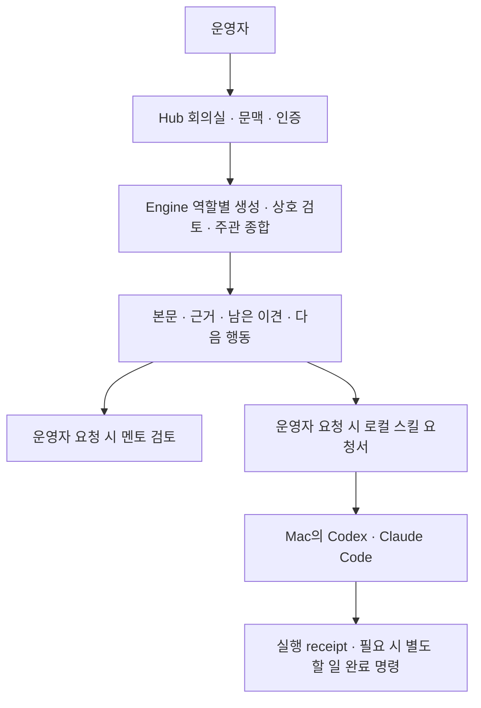

# Office 에이전트 — 외부 레퍼런스와 현재 구현 점검

> 상태: RESEARCH / 구현 승인 전. 제품 정본을 대체하지 않는다.
> 조사일: 2026-10-04 (Asia/Seoul)
> 요청: “그록 봇, codex dot 구조와 기능 참고해서 오피스 .에이전트 디벨롭”
> 기준 코드: d235372cd70d356c2f56fb3136ea02c14b0237a5
> 범위: 저장소·현행 스펙·공식 문서. 운영 DB·실제 모델·제품 계정은 확인하지 않았다.

## 1. 제품 식별과 외부 근거

실제 [Grok Bot 공식 문서](https://docs.x.ai/grok-bot/overview)가 확인됐다. “그록 봇”을 OpenClaw 오타로 간주할 필요는 없다. “Codex Dot”은 OpenAI의 Your dot을 기준으로 비교했다. Dot은 ChatGPT의 에이전트이며 로컬 연결 시 Work·Codex 작업을 만들 수 있다. 제품 식별에 대한 운영자 답변은 아직 없으므로 다른 제품을 뜻했다면 비교를 재검토한다.

확인된 기능은 공식 문서의 설명이다. 미공개 API·내부 저장 구조·운영자 계정의 실제 제공 여부를 확인한 것은 아니다.

| 공식 근거 | 확인된 구조·기능 | Office에 적용을 검토할 점 |
|---|---|---|
| [Grok Bot 개요](https://docs.x.ai/grok-bot/overview) | 이름·직무·누적 맥락을 가진 Bot. Bot별 대화·학습 맥락은 분리되고 계정의 cloud computer는 공유한다. | 역할별 이전 판단을 이어가는 방식. 업무 원본과 AI가 기억한 설명은 구분해야 한다. |
| [Grok Bot 대화·협업](https://docs.x.ai/grok-bot/chat-and-collaboration) | 여러 Bot의 그룹 대화·담당 지정·인계. 대화에 작업·파일·질문·승인 요청을 표시하고 단계별 단일 담당자를 권장한다. | 주관·검토자·로컬 실행자의 책임과 전달 자료·결과를 같은 안건에서 추적하는 방식. |
| [Grok Bot 스킬·루틴](https://docs.x.ai/grok-bot/skills-routines-and-automations) | Skill은 수행 방법, Routine은 실행 시점. 스킬에 입력·검증·출력·승인 경계를 포함한다. | 기존 로컬 요청서에 완료 조건과 결과 확인 방법을 일관되게 담는 방식. 일정 자동 실행 채택을 뜻하지 않는다. |
| [Your dot 시작하기](https://help.openai.com/en/articles/20001530-getting-started-with-your-dot) | 진행 중·예정·완료 활동 확인. 로컬 연결은 선택 사항이고 로컬 작업은 별도 Work·Codex 작업으로 나타난다. 맥락을 기억하고 명시적으로 예약한 일을 수행한다. | Office 대화와 실행 작업을 연결하면서 실행 주체를 구분하는 방식. 결과를 다시 찾는 활동 이력. |
| [Dot 접근·기억·제어](https://help.openai.com/en/articles/20001529-dots-privacy-security-and-safety-faqs) | 앱 접근 권한과 행동 규칙 관리. 현재 개별 Dot 기억의 직접 열람·편집·삭제에는 제한이 있다. | Office 기억을 도입한다면 출처·범위를 표시하고 개별 수정·제외할 수 있는 설계가 필요하다. 이는 Moonlight 적용 검토이며 Dot의 구현 기능이 아니다. |

외부 제품의 cloud computer·직접 도구 사용·자율 백그라운드 업무·외부 전송은 현행 Office 권한과 다르다. 참고 기능 설명을 Moonlight 구현 승인으로 취급하지 않는다.

## 2. 현재 구조

- 자유 회의: 브라우저 메모리 세션과 실행 로그. 안건·대화의 새로고침 복원 경로는 없다.
- 업무별 생성: office_requests와 영속 receipt·목록·복구·수정 parent 관계. 서버 활성 intent는 weekly_report·customer_reply다.
- 로컬 실행: 별도 skill request와 receipt. 기존 할 일 ID로 연결하고 실행자·완료 증거를 기록한다.

| 확인한 사실 | 코드 근거 |
|---|---|
| 자유 회의는 메모리 Map | [office-session.js](../../apps/hub/components/hub/office-session.js) 75~76행 |
| 멘토 후속 상담도 메모리 Map | [office-mentor-session.js](../../apps/hub/components/hub/office-mentor-session.js) 3~6행 |
| 다음 판에는 최근 4판의 사용자 글·종합 답변만 각각 2,000자로 전달 | [office-client.js](../../apps/hub/components/hub/office-client.js) 17~18행 |
| 할 일 가져오기는 최대 1,500자의 텍스트 복사 | [office-session.js](../../apps/hub/components/hub/office-session.js) 28행 |
| 서버 workflow의 활성 intent는 두 개 | [workflow-service.js](../../apps/hub/lib/office/workflow-service.js) 7행 |
| 계약의 freeform은 서버에서 활성화되지 않음 | [office-workflow.js](../../packages/agent-contracts/office-workflow.js) 5행, 위 서비스 117행 |
| 완료 증거·실행자·할 일 완료 명령 확인 UI가 이미 있음 | [office-skill-request-drawer.jsx](../../apps/hub/components/hub/office-skill-request-drawer.jsx) 18~35행 |
| 스킬 기록은 전체 최근 50건을 읽은 뒤 해당 할 일만 필터 | [office-skill-request.js](../../apps/hub/components/hub/office-skill-request.js) 3행, 109행 |
| 첫 의견·선택적 상호 검토는 같은 모델의 역할별 호출 | [deliberation.ts](../../apps/engine/lib/office/deliberation.ts) 74~76행, 131행 |
| 생성 호출에 도구가 없음 | [prompt.ts](../../apps/engine/lib/office/prompt.ts) 13행 |

이번 조사로 현재 운영 사용량이나 실제 장애 여부를 판단할 수 없다.

## 3. 이미 있는 기능

새 개발 항목으로 다시 만들 필요가 없는 기능:

- V4 결론 우선 회의실, 판별 이동, 역할별 발언 표시.
- 이브이 담당 추천과 운영자의 적용·수정·무시.
- 주관 후속 질문과 같은 안건으로 다시 회의.
- 현재 범위의 오래 멈춘 할 일, 최근 프로젝트 참고, 최소 업무 설정.
- Office 결과의 멘토 한 번 검토와 이어서 상담.
- 로컬 요청서 저장·복사와 실행 receipt 열람.
- 주간 정리·고객 답장의 영속 저장·복구 및 확인 후 새 할 일 연결.

근거: [회의실 코드](../../apps/hub/components/hub/pages/office-council.jsx), [회의실 V4 확정 스펙](../superpowers/specs/2026-09-24-office-meeting-room-layout.md), [에이전트 계층 방향](../superpowers/specs/2026-09-24-agent-layer-direction.md).

## 4. 개발 범위를 정할 때 검토할 공백

1. **대화 지속성:** 다음 접속에도 자유 회의·멘토 상담을 다시 열 수 있는가. 기존 workflow 재사용에는 서버·DB·계약 검토가 필요하다. freeform allowlist 하나만 여는 것으로 완성되지 않는다.
2. **판단 맥락:** 앞 판의 역할별 발언·남은 이견·판단 변경 조건을 다음 판에서 참조할 수 있는가. 안건 저장과 모든 대화를 자동 주입하는 장기 기억은 별도 범위다.
3. **할 일 연결:** 원래 할 일 ID·생성 시점 자료와 현재 기록의 차이를 확인할 수 있는가. 기존 workflow 적용은 새 할 일 생성이며 원래 할 일 수정 기능이 아니다.
4. **인계 추적:** 어떤 회의 결과로 어떤 요청서를 만들고 어느 실행자가 어떤 증거를 남겼는가. 현재 요청서에는 taskId가 있지만 Office 판과 명시적으로 연결하려면 계약 검토가 필요하다.
5. **이력 완전성:** 최근 전체 50건 밖의 해당 할 일 실행 기록을 찾을 수 있는가. task/request 기준 서버 조회·페이지네이션 필요성을 검토한다.

화면 변경은 최신 V4와 표면 예산을 기준으로 한다. 새 레일·버튼·진입문의 추가 범위는 아직 확정되지 않았다.

## 5. 유지할 현행 결정

[에이전트 계층 방향](../superpowers/specs/2026-09-24-agent-layer-direction.md)과 [운영자 프로필](../operator-workflow-profile.md)을 따른다.

- Office는 판단·초안·검토를 맡는다. 파일 조작·코드 수정·외부 전송 실행은 로컬 Codex·Claude Code가 맡고 Moonlight는 요청과 receipt를 기록한다.
- 요청서 복사나 모델의 완료 문장으로 실행 또는 할 일 완료를 표시하지 않는다.
- 회사·개인 맥락을 분리한다. 전체 범위의 영속 안건에는 레인 결정이 필요하다.
- 역할 카드 v25 말투 튜닝은 독립 재채점 전까지 동결한다.
- 인용 존재 확인과 같은 모델의 역할별 호출은 독립 의미 품질 인증이 아니다.
- 현재 실행 중 UI는 순서 예고이며 실제 진행률이 아니다.

## 6. 검증 범위와 다음 결정

비교 조사 문서만 작성했다. 앱 구현·마이그레이션·운영 배포는 수행하지 않았다. 외부 공개 설명과 저장소 구현을 구분하고 관련 경로와 스펙 관계를 확인했다.

다음은 개발 범위 선택이다. 대화 복구부터 좁게 시작할지, 안건·할 일·인계 이력을 함께 연결할지, 기존 펫의 Office 진입 경험을 먼저 개선할지를 선택한 뒤 승인된 설계·구현 계획을 작성한다.
