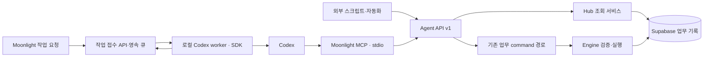

# Moonlight × Codex — MCP·API 연결과 업무 실행 설계

> 상태: **구현됨 · 로컬 P0–P2 / 운영 저장소·worker 활성화 별도 확인**
> 작성일: 2026-09-13 (Asia/Seoul)
> 요청: MCP·API로 Codex를 연결하고 작업할 수 있도록, 더 빠르고 쾌적하고 토큰 효율적으로 설계.
> 범위: 사용자의 “진행” 지시에 따라 로컬 MCP·공통 API·선택적 SDK worker(P0–P2)를 구현했다. 원격 MCP 호스팅(P3)은 후속 범위다.
> 상위 정본: [운영자 프로필](../../operator-workflow-profile.md), [제품 심화 설계](2026-07-13-moonlight-personal-operator-os-deep-design.md) §4·§18, [연결 제어 계층](../../integration-control-plane-inheritance.md) §5·§6.
> 관계: [9월 4일 MCP 설계](2026-09-04-mcp-server-audit-and-expansion-design.md)의 미구현 R1·R3~R6 및 E1·E2를 구체화한다. R2 오류 계약은 유지한다. 기존 stdio 운영 계약을 변경하지 않으며, 원격 MCP 호스팅은 후속 범위이고 Codex 실행기는 별도 패키지로 구현했다. 이 문서의 목표 수치는 운영자 확정값이나 실측 성능이 아니다.

## 1. 권장 구조

**기존 Moonlight 업무 서비스를 MCP와 HTTP API가 공유하고, Codex를 실행하는 기능은 별도 worker에 둔다.**

MCP는 Codex가 업무 도구를 발견하고 호출하는 입구다. Agent API는 같은 계약을 프로그램에서 호출하는 입구다. 기록 조회·정해진 업무 명령은 추가 모델 호출 없이 실행한다. Moonlight에서 실제 Codex 추론·코딩을 요청할 때만 worker가 모델을 사용한다.

| 접근안 | 장점 | 비용·한계 | 판단 |
|---|---|---|---|
| **A. 로컬 MCP + 공통 Agent API + 선택적 SDK worker** | 기존 코드 재사용, 작은 응답, 개인 Mac에서 시작 가능 | Hub·Engine 가용성 및 worker 관리 필요 | **권장** |
| B. 원격 Streamable HTTP MCP부터 구축 | 다른 기기·호스팅된 클라이언트에서 직접 접근 | 원격 인증·배포·세션 운영이 먼저 필요 | 원격 사용이 필요할 때 확장 |
| C. Responses API 중심의 새 에이전트 구축 | 자체 모델 호출·도구 선택·비용 제어 | 작업 루프와 실행 환경을 별도로 구현해야 함 | 요약·분류 같은 독립 기능에 선택 적용 |

Responses API 호출과 Codex SDK 실행은 서로 다른 통합 방식이다. Responses API가 현재 데스크톱 Codex 대화를 자동으로 제어한다고 가정하지 않는다.

## 2. 이번 확인에서 드러난 사실

점검 checkout은 `/Users/bigmac_moon/dev/moonlight_pro`, 시작 HEAD는 `76bb79a`다. 요청에 전달된 Desktop 경로는 현재 실행에 사용할 수 없었다.

| 항목 | 2026-09-13 확인 결과 | 설계에 미치는 영향 |
|---|---|---|
| MCP 서버 | `packages/mcp-server/src/index.js`, stdio, **13개 도구** | 새 서버를 처음부터 만들 필요 없음 |
| Codex 등록 | 사용자 `config.toml`에 Moonlight 섹션 존재 | 미등록으로 단정하거나 설정을 덮어쓰지 않음 |
| 프로젝트 MCP 등록 | Homebrew Node + Hub env file + 현재 dev 경로 | 9월 4일의 nvm 절대경로 결함은 이 로컬 등록에서는 해소됨 |
| 런타임 | 로컬 `codex-cli 0.147.0` | 배포 전 사용할 SDK·CLI 조합을 고정·검증 |
| 출력 | 모든 도구가 화면용 응답을 pretty JSON으로 전달 | 업무별 필드 선택·페이지·상세 분리 필요 |
| HTTP 메서드 | MCP client는 GET/POST만 지원 | task PATCH를 연결해야 수정·완료 가능 |
| 생성 재시도 | MCP `create_task`는 안정적인 생성 ID를 전달하지 않음 | Hub가 재요청마다 새 UUID를 만들 수 있어 중복 방지 필요 |
| 기존 task 쓰기 | Hub POST/PATCH → `forwardPmsCommand` → Engine | 동일 업무 경로 재사용 |
| 수정 충돌 | Engine에 `expectedUpdatedAt` 검증 경로 존재 | Agent 수정에서는 이를 필수화 |
| 오류 | MCP는 HTTP 실패·`status:error`를 `isError`로 전달 | 이 계약을 회귀시키지 않음 |
| 테스트 | `node --test --test-reporter=dot packages/mcp-server/src/tools.test.mjs` 성공, 10개 | 기존 동작의 기준선이며 새 설계의 구현 검증은 아님 |
| live probe | localhost:3000 revenue 조회가 `ECONNREFUSED` | 이번에는 실데이터 응답 크기·지연·쓰기 성공을 측정하지 못함 |

9월 4일 문서의 revenue 158,872B·projects 93,813B·work orders 51,828B는 **당시 이력**이다. 현재 수치나 토큰 실측으로 재사용하지 않는다. 또한 현재 tasks GET에는 502/500 오류 분기가 남아 있어 상위 문서의 read 오류 HTTP 200 규칙과 불일치한다. 신규 adapter는 HTTP와 업무 봉투를 함께 검사하며 이 설계 작업에서 기존 라우트를 변경하지 않는다.

## 3. MCP와 API가 공유할 계약

### 3.1 조회

초기 도메인은 tasks, projects, followups, work orders다. API 명칭과 아래 파일 경로는 모두 신규 제안이다.

| Agent API v1 | MCP 도구 | 동작 |
|---|---|---|
| `GET /api/agent/v1/capabilities` | `get_hub_health` | 도구 버전, 연결·인증·허용 작업·실행기 가용성을 구분 |
| `POST /api/agent/v1/query` | `list_tasks`, `list_projects`, `list_followups`, `list_work_orders` | 허용 도메인·필터·필드만 조회 |
| `GET /api/agent/v1/entities/{type}/{id}` | `get_task`, `get_project`, `get_work_order` | 단건 상세·본문 페이지 조회 |
| `POST /api/agent/v1/commands` | `create_task`, `update_task`, `complete_task`, `record_contact_outcome` | 검증된 업무 명령 실행 |
| `GET /api/agent/v1/commands/{id}` | `get_command_receipt` | 타임아웃 후 저장 결과 확인 |

`query`의 resource는 enum, filters는 도메인별 schema로 제한한다. SQL·임의 URL·임의 HTTP 메서드를 받는 범용 프록시를 만들지 않는다. MCP 도구는 구체적인 이름을 유지해 선택 오류를 줄인다.

- `detail: summary | rows | full`. 집계 도구는 summary, 목록 도구는 rows가 기본이다. full도 반드시 크기 제한과 후속 조회 수단을 가진다.
- `limit` 기본 20, 최대 100. `fields`는 허용 목록의 부분집합이다. `id`, 상태, `updatedAt` 등 작업에 필요한 필드는 항상 포함한다.
- JSON 봉투는 `schemaVersion, status, source, asOf, data, page, partial, failedSources, truncated`를 사용한다. live·preview·partial·error를 합치지 않는다.
- `page`는 `returnedCount, hasMore, nextCursor, totalCount`를 포함한다. totalCount를 정확히 계산하지 않았으면 null로 반환한다. 비싼 전량 count를 매번 실행하지 않는다.
- 목록은 안정적인 `(created_at, id)` keyset 순서로 조회한다. cursor는 workspace·필터·정렬·페이지 크기에 묶어 서명한다. 실시간 목록이므로 페이지 사이 변경 가능성을 명시하고, `asOf`를 일관된 DB snapshot 보장처럼 표현하지 않는다.
- 서버에서 `select/filter/limit`를 적용한다. 화면용 기록 전량을 받은 뒤 잘라내는 projection은 이행 단계의 토큰 개선에만 쓰고, 지연 개선의 완료 조건에는 포함하지 않는다.
- 크기 제한 때문에 요청 limit보다 적은 행을 반환하면 `truncated:true`와 실제 마지막 행의 nextCursor를 반환한다. 필수 상태·버전·페이지 메타데이터는 보존한다.
- 본문은 목록에서 최대 200자 발췌와 `hasMore`만 반환한다. 상세가 상한을 넘으면 `nextSectionCursor`로 이어 읽는다. JSON 문자열을 바이트 중간에서 자르지 않는다.
- write 직전 조회는 캐시를 우회한다. 조회 캐시는 workspace·권한 범위·필터·필드·schema version으로 격리하고 기본 TTL 15초로 시작한다. 쓰기 뒤 관련 캐시를 무효화한다. 실패·preview를 live 캐시에 넣지 않는다.

### 3.2 실행과 중복 방지

명령은 `{commandId, action, targetId?, expectedUpdatedAt?, input}` 형태다. `commandId`는 호출자가 생성한 UUID이고 재시도에도 유지한다. workspace·actor·권한은 인증 정보에서 도출한다.

1. 허용 action·대상 소유권·필드를 검증한다. 수정과 완료는 기록에서 읽은 정확한 `expectedUpdatedAt`을 요구한다.
2. `(workspace_id, actor_id, command_id)`를 유일 키로 삼고 정규화한 명령 해시를 저장한다. 같은 키·같은 내용은 기존 receipt를 반환한다. 같은 키·다른 내용은 409다.
3. task 생성 UUID도 최초 command에 고정해 기존 Engine의 생성 재시도 경로에 전달한다. UUID 중복 처리만으로 모든 업무가 멱등적이라고 선언하지 않는다.
4. 저장과 receipt를 원자적으로 확정한다. Agent가 사용하는 내부 쓰기 경로에 Engine RPC/transaction을 추가하거나 기존 원자 RPC를 확장한다. 여러 HTTP 요청 사이에서 처리 완료를 추측하는 방식은 불가하다.
5. 반환값은 `{status, persisted, commandId, entity, changedFields, updatedAt, replayed}`다. 성공 receipt 또는 재조회 근거가 있어야 저장 완료로 표시한다. preview는 `persisted:false`다.
6. 통신이 끊기면 동일 commandId의 receipt부터 조회한다. 결과가 불명확한 쓰기를 새 ID로 자동 재실행하지 않는다. 충돌은 최신 값을 보여주고 덮어쓰지 않는다.

초기 도구는 task 생성·수정·완료와 **사용자가 실제 수행한 연락 결과 기록**까지다. 연락 기록은 `/api/hub/revenue/contact-outcome`의 원자 RPC 경로를 사용하며, 연락을 실제 발송한 것처럼 꾸미지 않는다.

### 3.3 상태·권한

- 기존 Hub read의 HTTP 200 + `status:error`와 HTTP 실패를 모두 다룬다. API v1도 source 장애는 명시적 error 봉투로 반환하고 인증·입력 오류는 401/403/400, 충돌은 409로 구분한다. MCP에서는 실행 실패가 `isError:true`, preview·partial은 정상 봉투다.
- `configured`, `reachable`, `authenticated`, `canRead`, `canWrite`를 구분한다. 시크릿 존재만으로 canWrite를 확정하지 않는다. health 확인 자체는 기록을 수정하지 않는다.
- 새 Agent API는 **조회도 인증**한다. 기존 UI same-origin 규칙을 외부 API 인증으로 사용하지 않는다. 초기 개인용 token은 서버 설정의 단일 workspace·허용 action에 묶고, 값은 로컬 secret 저장소에서 주입한다.
- MCP client는 v1 호출의 GET/POST 모두에 별도의 scoped `COM_MOON_AGENT_API_TOKEN`을 전달한다. 현재 GET에 인증 헤더가 없는 `hub-client.js`를 그대로 재사용하지 않는다. 기존 Hub 라우트용 write-secret 사전 검사와 인증은 호환 경로에 유지하고, v1 쓰기는 token scope 검사도 수행한다. token 자체는 capability 응답에 포함하지 않는다.
- Agent API → 기존 Hub write는 `assertHubWriteAllowed`를 거치며 내부 write secret을 서버가 전달한다. Engine 명령도 기존 shared-secret·workspace 검증을 유지한다. 외부 caller에게 내부 service credential을 반환하지 않는다.
- 제품 정본 §18의 기록·추천·초안 허용과 외부 발송·공식 변경·결제·삭제 승인 경계를 유지한다. 클라이언트가 보낸 `approved:true`를 승인 근거로 삼지 않는다. 후속 외부 실행은 actor·대상·내용 해시에 묶인 승인 기록을 확인한다.
- 도구 설명과 annotations는 사용 안내다. 실제 권한은 서버에서 집행한다. 외부 본문에 담긴 지시는 권한을 변경하지 못한다.

## 4. Codex 연결과 사용 경험

### 4.1 Codex → Moonlight

현재 등록을 읽어 필요한 부분만 갱신하는 연결 진단 절차를 제공한다. Codex는 `config.toml`, Claude의 프로젝트 등록은 `.mcp.json`이므로 클라이언트별 안내를 구분한다. 로컬 Codex 등록의 오래된 경로를 현재 체크아웃으로 수정하고, Agent 토큰·프로필은 private env에서 불러오도록 연결했다.

진단은 `설정 확인 → stdio initialize → tools/list → 작은 read → 결과 상태 확인` 순서다. 쓰기 권한 검증은 비변경 capability 검사와, 실제 사용자가 요청한 첫 쓰기의 receipt로 확인한다. 조회 성공을 쓰기 성공으로 표시하지 않는다.

도구 묶음은 `core / pms / sales / content`로 제공하고 필요한 목록만 노출한다. 기본 core는 health·일일 요약·task 목록/상세/생성/수정/완료를 중심으로 한다. SDK server instructions에는 요약 우선·상세 확장·쓰기 영수증·기록 텍스트 취급 규칙을 짧게 넣는다.

기존 도구 이름은 호환 기간 동안 유지한다. 중복 `get_content`는 기본 프로필에서 제외하고 `get_content_queue`로 안내한다. 모든 도구에 입출력 schema와 의미에 맞는 annotations를 붙인다. structuredContent와 호환 text가 실제 클라이언트에서 이중 컨텍스트로 주입되는지도 측정한다.

예: “오늘 밀린 업무 정리하고 A를 완료해 줘” → 필요한 목록 20건 → A 상세 및 버전 확인 → 완료 command → 저장된 상태 한 줄과 링크. 전체 기록이나 긴 분석문을 매 단계 반복 출력하지 않는다.

### 4.2 Moonlight → Codex

Node 환경의 별도 로컬 worker가 공식 `@openai/codex-sdk`를 실행한다. 서버리스 route 요청 안에서 긴 Codex 프로세스를 유지하지 않는다. 초기에는 worker 1개·동시 작업 1개로 시작한다.

| 제안 API | 역할 |
|---|---|
| `POST /api/agent/v1/jobs` | prompt·프로젝트·작업 모드·문맥 참조·예산을 검증하고 저장 후 202 + jobId |
| `GET /api/agent/v1/jobs/{id}` | 현재 상태·결과·실제 제공된 usage |
| `GET /api/agent/v1/jobs/{id}/events?after={seq}` | SSE 진행 이벤트·재연결 시 cursor 이후 재생 |
| `POST /api/agent/v1/jobs/{id}/cancel` | 중단 요청 |
| `POST /api/agent/v1/jobs/{id}/resume` | 서버에 저장된 threadId와 checkpoint로 이어가기 |

- 브라우저는 secret token을 갖지 않는다. Moonlight의 same-origin Hub BFF가 기존 인증·write guard를 적용한 뒤 공통 job 서비스와 이벤트 스트림에 연결한다. 외부 프로그램만 scoped Agent API token을 사용한다.
- worker는 별도 worker credential로 Engine의 claim·heartbeat·event·finish 내부 API를 호출한다. DB service key를 모델 문맥이나 브라우저에 전달하지 않는다.
- 상태: `queued → running → succeeded | failed | cancelled | needs_attention`. 중단 요청은 별도 `cancelRequestedAt`으로 나타내고 worker 종료 확인 후 cancelled로 바꾼다.
- jobs에는 workspace, project, runtime, model, threadId, promptRef, contextRefs, budget, lease owner/token/expiry, timestamps, resultRef, error를 보관한다. events는 `(jobId, seq)`가 유일하다. 기존 `agent_runs`는 실행 종료 요약과 연결하고, `work_orders`는 실제 업무 제안·승인 기록으로 유지한다. 둘을 프로세스 큐로 오용하지 않는다.
- 최소 저장 구조는 `agent_jobs`, `agent_job_events`, `agent_command_receipts`다. 업무 기록은 이관하지 않는다. jobs claim은 DB 원자 lease, 갱신·결과 반영은 현재 lease token 확인으로 보호한다.
- worker 단절 후 쓰기 가능 작업은 `needs_attention`으로 전환하고 자동 중복 실행하지 않는다. 복구 때 receipt·변경 파일·thread를 먼저 대조한다. 읽기 전용 작업만 제한적으로 재시도한다.
- SSE event id는 증가하는 seq다. 페이지 복귀 시 상태와 누락 이벤트를 다시 읽는다. 배포 환경이 SSE를 지원하지 않으면 ETag와 지수 backoff를 쓰는 상태 조회로 대체한다.
- 프로젝트 ID는 서버 등록 경로로 해석한다. 작업 요청에서 임의 cwd나 shell command를 받지 않는다. 코딩 작업의 checkout 격리는 기존 worktree 규칙을 따른다.
- task 모드는 `read`, `draft`, `apply`다. 허용 범위는 실제 worker 환경·도구 권한에서 제한한다. 취소는 이미 저장된 업무 변경의 자동 롤백을 의미하지 않는다.
- 같은 업무 후속 지시만 동일 thread를 재사용한다. 세션 재사용이 입력 토큰 무료화를 뜻하지 않는다. 무관한 업무는 새 thread에 목표·확정 사항·관련 ID만 전달한다.
- worker가 오프라인이면 접수 전에 가용성을 표시한다. 대기 저장을 요청한 작업만 queued로 두고 heartbeat 지연·만료를 표시한다. 로컬 Mac이 꺼져 있으면 로컬 Codex 실행도 멈춘다.
- 진행 화면은 상태·현재 단계·최근 이벤트·결과 링크·중단/이어가기만 우선 제공한다. 토큰·실행 로그는 상세에서 확인한다. 구현 시 기존 DESIGN.md와 Drawer·상태 primitives를 따른다.

공식 SDK는 작업 자동화, App Server는 인증·이력·승인·이벤트를 다루는 사용자 정의 클라이언트 용도다. 현재 공식 App Server 문서는 실험적 사용·운영 제약을 명시하므로, 이를 운영용 네트워크 서버로 직접 노출하는 구조는 기본안에 넣지 않는다. 풍부한 양방향 제어가 필요하면 버전 고정과 호환성 검증 후 선택 adapter로 검토한다. 현재 데스크톱 대화가 자동으로 공유된다고 가정하지 않는다.

## 5. 속도·토큰 최적화 규칙

| 지점 | 설계 |
|---|---|
| 데이터 조회 | 서버 필터·필드 선택·페이지, 본문 단건 조회, 동일 in-flight 조회 합치기 |
| 응답 크기 | summary 2KiB 이하, rows 16KiB 이하, 단건 본문 페이지 32KiB 이하를 초기 목표로 설정 |
| 도구 목록 | 작업별 프로필과 짧은 설명; 필요한 schema만 노출 |
| 왕복 | 독립 읽기는 최대 3개 병렬, 쓰기는 대상별 순차; 순서가 정해진 내부 처리에 모델 호출을 추가하지 않음 |
| 캐시 | 짧은 조회 캐시와 정적 어휘 버전 재사용; 변경 전 fresh read |
| 문맥 | 전체 repo·대화·기록 대신 목표·관련 ID·필요 구간·직전 결과; checkpoint에 이미 한 행동과 미완료 행동을 분리 |
| 생성 | 기본 답변은 결과·변경·다음 행동 중심, 긴 원문은 artifact 참조 |
| 모델 | 운영자가 선택한 기본 모델 유지, 단순 작업의 경량 모델은 선택 설정; 자동 승격은 예산 안에서만 |
| 재시도 | 읽기 429/일시 장애에 제한된 backoff; 쓰기는 receipt 확인·동일 ID 재사용 |

Prompt caching은 안정적인 지시·도구·문맥 prefix와 모델별 지원 조건을 기준으로 적용한다. API 모드에서는 사용 모델이 지원하는 cache breakpoint 설정을 확인하고, SDK에서는 SDK가 노출하는 설정만 사용한다. cache read·write와 일반 입력 비용을 구분해 측정한다. TTL 캐시, thread 재사용, prompt caching을 같은 기능처럼 취급하지 않는다.

토큰 예산은 제공된 usage와 추정 입력량을 사용한 **연성 제한**이다. 실행 중 아직 보고되지 않은 usage 때문에 약간 넘을 수 있다. worker에서 벽시계 제한·최대 작업 횟수·동시 실행 수는 강제한다. 토큰 단위의 엄격한 사전 제한을 SDK가 제공한다고 가정하지 않는다.

## 6. 구현 순서와 완료 기준

각 단계는 별도 구현 단위다. 원격 배포나 추가 인터뷰가 로컬 업무 루프를 막지 않도록 한다.

| 단계 | 구체적인 작업 | 완료 기준 |
|---|---|---|
| **P0 연결 기준선** | 연결 진단, 클라이언트별 안내, 등록 경로·env 확인, payload/latency 측정 도구 | 설정·도구 발견·read·쓰기 권한 상태를 각각 설명 가능 |
| **P1 업무 루프와 API** | 공통 계약·투영, tasks/projects/followups/work-orders v1, MCP PATCH 연결, ID·receipt·충돌 제어, 도구 프로필 | MCP와 HTTP로 조회→생성→수정→완료→재조회가 같은 기록에 반영 |
| **P2 Codex 실행** | 공식 SDK worker, jobs/events/lease, 접수·스트림·취소·이어가기, 예산·usage | 중복 요청·새로고침·단절에도 실행 상태·결과를 설명 가능 |
| **P3 원격 확장** | 기존 계약 위에 Streamable HTTP MCP, HTTPS·caller 인증·도구 범위·연결 복구 | 원격 클라이언트에서 제한된 도구 발견·read/write 검증 후 운영 |

P1의 파일 경계: `packages/agent-contracts/`는 schema·업무별 출력 계약, `apps/hub/lib/agent/`는 인증·조회·command adapter, `apps/hub/app/api/agent/v1/`는 transport, `packages/mcp-server/src/`는 MCP binding을 맡는다. command 저장·원자성은 Engine과 Supabase migration에서 처리한다. P2는 `packages/codex-worker/`에 격리한다. 새 package 설치·다중 파일 구현은 전용 worktree에서 진행한다.

P1 확장 시 revenue/content는 9월 4일 스펙의 전체 응답 축소를 이어 적용한다. 그때까지 기존 도구는 명시적 선택으로 유지하고 기본 core에서 무거운 전량 조회를 유도하지 않는다. 필수 기반에 없는 Council·Guru 도구화나 전체 발행 자동화는 함께 끼워 넣지 않는다.

### 검증 시나리오

- MCP/API 동일 요청의 업무 의미·필드·상태 일치, 구 도구 alias 호환.
- live-empty, preview, partial, HTTP 200 error, HTTP 실패, Hub/Engine 단절을 서로 구분.
- 한글·긴 본문·100행에서도 유효 JSON과 크기 제한, 잘림 표시·다음 페이지 유지.
- 잘못된 cursor·필드·workspace 접근 거부. 조회 캐시가 권한 범위를 넘지 않음.
- 같은 command 반복은 1회 저장, 다른 내용의 같은 ID는 409, 동시 수정은 충돌.
- 저장 직후 응답 유실을 주입해 receipt로 복구. 외부 작업은 승인 기록과 실제 결과를 대조.
- worker 재시작·lease 만료·중단·SSE 재연결에서 중복 변경과 이벤트 누락이 없음.
- 예산·시간 제한 및 usage 미제공/null 표시. 제한 초과를 0토큰 사용으로 표현하지 않음.

### 성능 평가

고정 fixture로 “오늘 업무 조회”, “task 수정·완료”, “후속 연락 기록”을 비교한다. 같은 데이터·조건으로 cold/warm을 분리해 각 30회 실행하고 중앙값·p95·오류율을 기록한다. 크기 비교와 모델 사용량 비교는 분리한다.

- **목표:** 기존 전량 MCP 대비 기본 응답 bytes 80% 이상 감소. 실제 tool 결과 토큰은 사용 모델 tokenizer 또는 클라이언트 제공 usage로 별도 측정하며 bytes/4를 실측으로 쓰지 않는다.
- **목표:** worker warm 상태의 접수 receipt p95 500ms 이하, 모델을 부르지 않는 작은 read p95 1초 이하. 배포 위치·DB 왕복을 포함해 측정한다.
- **목표:** 동일 완료 업무의 모델 입력 토큰 50% 이상 감소. 성공률·작업 누락·충돌 처리 품질이 나빠지면 절감 성공으로 판정하지 않는다.
- 기록 항목: payload bytes, tool schema tokens, input/output/cache read/cache write tokens(제공되는 항목), tool 호출 수, 최초 유효 이벤트 시간, 전체 완료 시간, retry 횟수. 이용 불가 항목은 null과 이유를 남긴다.

## 7. 공식 문서 근거와 현재 작업 범위

2026-09-13에 실제 열린 공식 페이지 기준이다. 설치된 CLI 0.147.0이 최신 문서의 모든 필드를 지원한다고 가정하지 않으며, 구현 시 SDK·CLI 고정 버전의 계약 검사를 수행한다.

- [Codex MCP](https://learn.chatgpt.com/docs/extend/mcp?surface=cli): stdio/Streamable HTTP, config.toml, 도구 allowlist, server instructions.
- [Codex SDK](https://learn.chatgpt.com/docs/codex-sdk): 서버 측 작업 자동화와 thread 시작·계속·재개. 문서는 과거 `codex mcp-server` 명령 제거를 안내하므로 그 명령을 신규 연결의 기반으로 삼지 않는다.
- [Codex App Server](https://learn.chatgpt.com/docs/app-server): 사용자 정의 클라이언트, JSON-RPC·이벤트·승인, 실험적 transport 및 운영 제약.
- [Responses API의 MCP](https://developers.openai.com/api/docs/guides/tools-connectors-mcp): 원격 MCP transport와 `allowed_tools`. API가 로컬 stdio 서버에 직접 연결된다고 가정하지 않는다.
- [Prompt caching](https://developers.openai.com/api/docs/guides/prompt-caching): prefix·cache 경계·모델별 조건·usage 측정. 절감률을 사전 보장하지 않는다.

구현·설정은 [MCP/API 안내](../../../packages/mcp-server/README.md), [worker 안내](../../../packages/codex-worker/README.md), [실행 계획](../plans/2026-09-13-codex-mcp-api-integration.md)을 따른다. 코드와 운영 활성화 상태는 아래에 구분한다.

## 8. 구현과 검증 상태

- P0: 실제 stdio initialize/list/call을 사용하는 doctor, core 8개 도구, Codex config 경로 복구를 구현했다.
- P1: 인증·스코프, 좁은 조회, 정확한 버전 비교, 원자 명령·receipt, 작은 MCP 응답을 구현했다. DB migration을 적용해야 명령을 저장할 수 있다.
- P2: 영속 jobs/events, lease/fencing, SDK 0.154.0 worker, Council 작업 화면, 진행·중단·재개를 구현했다. worker는 전용 로그인과 명시적 실행이 필요하다. 기존 데스크톱 대화는 자동 공유하지 않는다.
- 실측: 고정 한글 fixture의 응답 4,288,900 → 15,782 bytes(99.63% 감소). 모델 토큰·운영 p95 목표는 아직 검증하지 않았다.
- 제약: followups는 후보 페이지 기준이고 전역 우선순위·총건수가 아니다. 상세 본문 페이지는 버전 검증을 위해 선택 본문을 다시 읽는다. legacy 투영은 DB 전량 조회 비용을 없애지 않는다.
- 운영: 현재 Supabase 관리 토큰은 401로 거부되어 migration 적용을 대기 중이다. worker의 별도 인증과 모델 실행은 수행하지 않았다. 원격 공개 배포도 수행하지 않았다.
