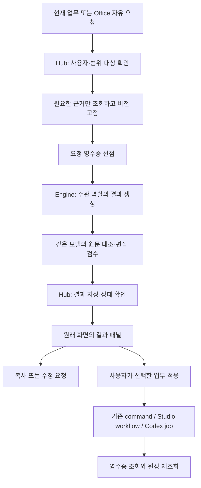
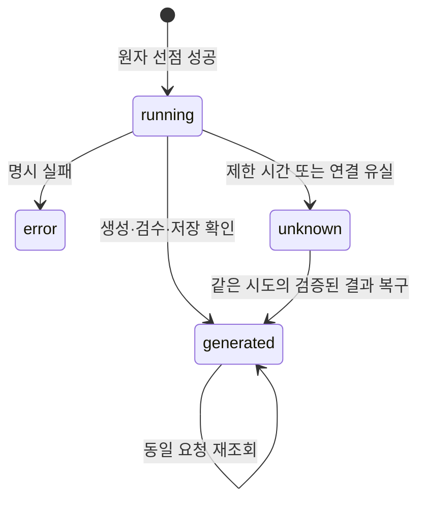

# Eevee Office — 업무 안의 C레벨 심화 설계

> 상태: **구현 승인 · E0~E4 로컬 구현 / 운영 적용 대기**
> 날짜: 2026-09-21
> 요청: 운영자의 “진행, 심화 설계”에 이어 “구현, 서브에이전트 동원”.
> 승인 범위: B 방향의 E0~E4 코드 구현. 실제 반영 범위와 검증은 [구현 기록](../plans/2026-09-21-eevee-office-embedded-workflow.md) §9가 정본이다. 기타 표면·장기 기억·자동 실행 제안의 개별 세부값까지 확정한 것은 아니다.
> 상위 정본: [운영자 프로필](../../operator-workflow-profile.md), [개인 OS](2026-07-13-moonlight-personal-operator-os-deep-design.md), [DESIGN.md](../../../DESIGN.md), [문서 지도](../../README.md).
> 관계: [통합 검토](../../2026-09-21-agent-office-consolidated-review.md) §5~10과 [표면 역할 배치](2026-09-21-eevee-office-surface-role-map.md) §12~14를 상세화한다. 기존 9인 ID·회사/개인 경계·Guru/Legend 기억 분리를 유지한다. §2의 대체안 중 구현된 E0~E4만 현재 동작이며 나머지는 후속 제안이다.
> 구현 사실: [운영 품질 v2](2026-09-21-eevee-office-operating-quality.md)의 과거 평가와 현재 소스를 구분한다. 로컬 계약·실제 임시 PostgreSQL·브라우저를 검증했으며 새 실제 모델 평가, 운영 DB 적용, worker 연결 검증은 수행하지 않았다. Studio는 기존 단일 생성·형식 검증을 유지한다.

## 1. 제품 약속과 선택한 방향

**“내 업무를 정리하고, 바로 쓸 결과물과 다음 행동을 만드는 9명의 역할별 AI 오피스.”**

고객을 보고 있으면 고객 답장을, 원고를 보고 있으면 원고 수정을 바로 맡긴다. 결과는 그 업무 옆에 남는다. 복합적인 고민이나 긴 대화가 필요할 때 Office를 연다. 사용자는 조직도나 모델 실행 방식을 먼저 배울 필요가 없다.

현재의 공개 가능한 설명은 `입력한 자료로 답변·초안을 생성`이다. 문맥 어댑터가 연결된 기능부터 `선택한 업무를 참고`, 실제 적용이 연결된 기능부터 `검토한 결과를 업무에 반영`으로 설명을 넓힌다. 인지 에너지 1/3과 후속 누락 0건은 운영 목표다.

### 설계 판단 기록

| 항목 | 판단 | 근거 |
|---|---|---|
| 대안 A: Office 외형만 정돈 | B의 첫 단계로 포함 | 빠르게 선택 부담·모순을 줄일 수 있으나 재입력 문제는 남음 |
| 대안 B: 업무 안의 Office | 이번 설계 방향 | 기존 CRM·PMS·Studio 원장을 살리면서 결과를 이어 사용 |
| 대안 C: 별도 중앙 작업대 | 후속 | 대화함·업무함·실행함을 다시 만드는 비용에 비해 필요 증거 부족 |
| 9인 캐릭터 | 유지 | 책임과 말투의 구별은 자산. 노출 횟수까지 균등하게 맞추지 않음 |
| 한 요청의 책임 | 주관 1명 | 단순 업무를 접수→전략→검토 회의로 늘리지 않음 |
| 첫 업무 연결 | 주간 정리 | 운영자 Q118·Q119 우선순위, 기존 기간 집계 재사용 |
| 신규 업무 원장 | 만들지 않음 | task·고객 활동·콘텐츠·job의 현재 정본 유지 |
| 요청 영수증 | 제한된 신규 저장 제안 | 현재 Office에 선점·조회·재생 방지가 없고 기존 AI 후보는 주간 집계·고객에 적용 불가. §10 |

이번의 구체적 사용 이득은 “샤미드에게 업무 상황을 다시 설명”하는 단계를 없애고, 주간 카드의 근거로 작성한 같은 결과를 복사하거나 다음 행동으로 연결하는 것이다.

## 2. 기존 명세와의 관계·충돌 해소

| 기존 위치 | 유지 | 본 설계의 대체 제안 |
|---|---|---|
| [Office v1](2026-09-15-eevee-office-council-personas.md) §19~25 | 새 Office와 기존 Guru·Council·Legend의 서비스·기억 경계 | 구현 단계 표시는 실제 릴리스마다 갱신 |
| [C-Suite OS](2026-09-21-eevee-office-c-suite-operating-system.md) §1~3 | 단일 추천·판단 변경 조건·상태 정확성 | 실행 도구 없는 역할 예시는 `정리했습니다/초안을 만들었습니다`까지만. `일정을 옮겼습니다/연락하겠습니다` 제거 |
| 같은 문서 §3 | 네 가지 협업 조합 | `유일한 4개 챔버` 대신 `추천 조합 4개`; 유효한 2~3인 선택 허용 |
| 같은 문서 §4 | 구조화 출력의 목적 | 현재 parser에 없는 meta를 그대로 보내지 않음. 새 workflow 계약을 별도로 정의 |
| 같은 문서 §5 | 인지 부담·누락 감소의 지향 | 달성·100% 보장 문구를 측정할 목표로 교정 |
| [통합 프레임워크](2026-09-21-council-mentor-guru-legend-operating-framework.md) §2·6 | 간결한 판단·이견 보존 | 600/700자 제한은 결과물 전체에 강제하지 않음. 요약과 본문을 분리 |
| [보이스 심화](2026-09-21-eevee-office-voice-and-personality-deep-design.md) | 역할별 관심·반응 차이 | Tier 숫자와 번아웃 진단을 제품 문구에서 제외. 사용자가 선택하는 `오늘은 최소한만`으로 표현 |
| [표면 역할 배치](2026-09-21-eevee-office-surface-role-map.md) §3~11 | 기능별 담당·시나리오 지도 | 아래 실행 단계가 연결 순서·노출 수준을 구체화 |

가역성은 `reversible / irreversible`로 표현한다. 실행 가능 여부는 서버의 capability가 판정한다. 가역적이라는 이유로 아직 없는 도구를 사용했다고 말하지 않는다.

홈·오늘·현황의 최신 [역할 분리 초안](2026-09-21-home-today-overview-role-design.md)은 주간 집계를 현황으로 옮기는 안을 포함한다. Office는 위치를 소유하지 않는다. 첫 구현은 현재 주간 카드에 연결하고, 카드가 이동하면 같은 reportRef와 결과 패널을 이동한다. 홈에 새 AI 브리핑 카드를 추가하지 않는다.

## 3. 구조: 책임·대화 방식·방법론·실행 분리



| 층 | 소유 내용 | 권한 경계 |
|---|---|---|
| Office 역할 | 문제를 보는 관점·책임·산출물 | 역할 이름은 도구 권한이 아님 |
| 응답 방식 | 대화·초안·검토·관점 비교 | Council도 단일 모델 시뮬레이션 |
| Guru 방법론 | 영업·기획 등의 실무 접근 | 기존 Guru 호출과 지침 참조는 별개 |
| Legend 관점 | 가치·기회비용·판단 변경 기준 | Office 미연결 상태 유지; 이름만 붙여 적용했다고 하지 않음 |
| Context adapter | 대상·기간·출처·scope를 제한한 서버 조회 | 브라우저 본문·숨은 메타데이터를 사실로 승격하지 않음 |
| 업무 실행 | 실제 저장·갱신·코딩 실행 | 기존 원장의 인증·CAS·중복 방지·receipt 사용 |

초기에는 두 번의 모델 호출을 유지한다. UI에서 검토자를 블래키로 고르는 것은 별도의 판단 관점을 요청하는 행위이며, 기본 편집 검수를 독립 에이전트의 사실 인증으로 표시하지 않는다. API 반환의 `generated`는 생성 완료일 뿐이다.

## 4. 아홉 역할의 실무 계약과 피치

각 역할은 **판단 질문 하나, 필요한 자료, 납품물, 판단을 바꿀 조건**으로 정의한다. 인사말·성격 설명은 결과 본문을 차지하지 않는다.

| 담당·짧은 피치 | 판단 질문·필요 자료 | 기본 납품물 | 이 역할에서 끝내지 않을 조건 |
|---|---|---|---|
| 이브이 CoS — 복잡한 요청을 다음 한 걸음으로 | 지금 정할 것은 무엇인가; 사용자의 원문·기한·원하는 결과 | 요청 정리, 담당, 추천 하나 | 기능·고객 등 목적이 이미 명확하면 해당 담당 직행 |
| 샤미드 COO — 끝낼 순서와 남길 약속 | 언제 무엇을 할 수 있나; 기한·실제 일정·명시 가용 시간 | 실행 순서, 대기 조건, 주간 정리 | 범위 충돌은 글레이시아, 선택·포기는 에브이 |
| 부스터 CRO — 고객의 다음 반응을 만드는 연락 | 이번 접촉 목적은 무엇인가; 고객 발언·기존 약속·거래 단계 | 보낼 메시지, 접촉 목적, 실제 연락 뒤 기록할 항목 | 금액 계산 리피아, 확인 안 된 지원 약속 블래키 |
| 님피아 CMO — 내 생각을 내 말로 완성한 글 | 누구에게 무엇을 전달하나; 선택 원문·독자·브랜드·채널 | 완성 원고 또는 수정안 | 없는 경험을 보충하지 않음; 사실 부족은 원리 설명 등 가능한 형식으로 전환 |
| 글레이시아 CPO — 이번 완료의 기준을 선명하게 | 무엇이 되면 끝인가; 사용 장면·제약·기존 흐름 | 최소 흐름, 포함/제외, 정상·실패·중복·재조회 기준 | 구현 결과는 쥬피썬더와 실제 job에 귀속 |
| 쥬피썬더 CTO — 동작 증거로 확인하는 기술 | 어디서 어떻게 실패하나; 제공된 코드·로그·계약 | 진단 가설, 최소 패치 초안, 검증 절차 | 저장소/도구 미연결이면 수정·테스트 완료를 말하지 않음 |
| 에브이 CSO — 선택과 포기의 이유를 분명하게 | 이번 선택이 무엇을 밀어내나; 대안·근거·제약 | 추천, 포기 비용, 작은 검증, 변경 조건 | 일상 순서·명확한 단순 요청에 사업 전략을 덧붙이지 않음 |
| 리피아 CFO — 돈·시간·유지 부담을 함께 계산 | 같은 기간에 무엇이 남나; 비용·설정/유지 시간·기준 기간 | 현금/순시간 분리 표, 가정, 재검토 조건 | 시간 절감을 매출로 전환하지 않음; 자료 없으면 필요한 항목만 |
| 블래키 Risk — 진행할 수 있게 고치는 검토 | 어떤 주장·약속에 근거가 부족한가; 원문·산출물·출처 | 문제 위치, 영향, 대체 문장 | 취향을 차단 사유로 쓰지 않음; 외부 전문 판단을 완료했다고 하지 않음 |

### 결과물의 깊이와 길이

- 짧은 질문: 결론 1~3문장. 추가 업무가 필요 없으면 다음 행동은 없음.
- 초안: 복사 가능한 결과물 전체 + 필요한 가정/빈칸. 고객에게 보낼 문장에 내부 검토 주석을 섞지 않는다.
- 검토: 중요한 수정부터, 문제와 대체안을 함께. 원문 전체를 무조건 재작성하지 않는다.
- 관점 비교: 참여 관점별 차이, 남은 이견, 주관 추천, 판단 변경 조건. 같은 결론을 세 번 반복하지 않는다.
- 최소 업무 모드: 명시된 약속을 보존하면서 신규 과제를 줄인다. 시간이 0이면 억지 nextAction을 만들지 않는다.

정중한 한국어를 기본으로 한다. 주간 보고의 문체, 고객 메시지의 문체, 개인 원고의 문체는 산출물의 독자를 따른다. 성격은 말끝보다 우선해서 보는 증거와 선택의 차이로 드러낸다.

## 5. 담당 라우팅과 협업

라우팅 우선순위는 **명시한 담당 → 선택한 업무 행동 → 표면 기본 담당 → 이브이**다. 서버가 지원하는 역할인지 검증하며 사용자가 명시한 담당을 페이지 기본값으로 덮지 않는다. 모델이 역할을 추천할 수는 있지만 숨은 추가 호출을 시작하지 않는다.

| 선택 행동 | 기본 담당 | 기본 모드 | 비교가 유용한 경우 |
|---|---|---|---|
| 이번 주 정리 | 샤미드 | draft | 상충하는 다음 주 선택이 있을 때 이브이/에브이 |
| 답장 초안 | 부스터 | draft | 지원·수치 약속이 쟁점일 때 블래키 |
| 원고 다듬기 | 님피아 | draft 또는 review | 사실과 표현 충돌이 있을 때 블래키 |
| 최소 범위 정리 | 글레이시아 | draft | 구현 가능성 비교 시 쥬피썬더 |
| 오류 진단 | 쥬피썬더 | review | 이미 수행된 변경이 불명확할 때 블래키 |
| 돈·시간 비교 | 리피아 | review | 신규 기회 선택이면 에브이 주관 |
| 방향 선택 | 에브이 | council 또는 chat | 현상 유지와 기회비용이 실제로 충돌할 때 |

현재 네 조합의 표시명은 `고객 제안 검토 / 기능·구현 검토 / 돈·시간 비교 / 이번 주 정리`로 제안한다. 추천 참여자는 기존과 같다. 사용자는 주관 포함 2~3명으로 바꿀 수 있다. 단순 주간 보고 버튼은 샤미드 한 명이며, 주간 관점 비교 프리셋과 구별한다.

선택한 담당·모드·참여자 변경만으로 생성하지 않는다. 작성 중인 원문은 유지하고 새 요청을 보낼 때 적용한다. 참여자 변경 뒤 이전 결과를 새 참여자의 답으로 다시 라벨링하지 않는다.

## 6. 탭·섹션의 소유권

### 기존 주소를 살리는 목표 배치

최상위 사이드바는 추가하지 않는다. AI·자동화 내부의 기존 네 Agents 목적지는 아래처럼 정리한다.

| 현재 경로 | 제안 라벨 | 소유하는 내용 |
|---|---|---|
| `dashboard/agents/office-council` | Office | 자유 요청, 선택 역할의 초안·검토·관점 비교 |
| `dashboard/agents/orders` | 작업·실행 | `작업 지시 / 코드 작업` 두 보기. `?view=jobs`는 새 보기 계약 |
| `dashboard/agents/chat` | 코칭·대화 | 기존 Guru·페르소나·인물 관점의 대화 |
| `dashboard/agents/council` | 브랜드 자문 | 기존 브랜드 Council, 기존 서비스·로그 유지 |

`CodexJobsPanel`은 브랜드 자문에서 작업·실행의 코드 작업 보기로 이동한다. 기존 위치에는 목적지 링크를 남긴다. `/dashboard/agents/office`의 Chat 호환 리다이렉트는 조용히 새 Office로 바꾸지 않는다. `/dashboard/agents` 기본 진입 변경도 이번 필수 범위가 아니다.

작업 지시와 코드 작업의 상태 enum은 합치지 않는다. 코드 작업의 `succeeded`는 배포 완료가 아니고, 작업 지시의 `approved`는 실행 완료가 아니다. Codex jobs는 현재 actor·등록 프로젝트 기준이므로 회사/개인 필터를 지원하는 것처럼 표시하지 않는다. 기존 `준비 중` 표시는 해당 기능의 실제 준비가 확인되기 전 유지한다.

자동화의 개요·Runs·Webhooks는 계속 실행 상태를 소유한다. 모델 호출 로그를 새로운 성과 대시보드로 올리지 않는다.

### 일반 업무 화면의 노출 규칙

| 업무 화면 | 상시 주 행동 | Office 보조 행동 | 결과 위치 |
|---|---|---|---|
| 홈 | 확인할 업무로 이동 | 첫 버전 추가 없음 | 원래 업무 상세 |
| 오늘/현황의 주간 카드 | 기간·범위·근거 확인 | 이번 주 정리 · 샤미드 | 카드 아래 결과 패널 |
| 고객 상세·연락 | 연락 결과 기록 | 답장 초안 · 부스터 | 선택 고객 상세 내부 |
| Studio | 편집·저장·후보 적용 | 원고 다듬기 · 님피아 | 기존 후보·비교 영역 |
| 프로젝트 | 작업·기한·상태 관리 | 현재 쟁점 정리 | 같은 프로젝트 상세 |
| 기회·목표 | 근거·관측 기록 | 선택 검토 · 에브이 | 해당 결정의 근거 옆 |

보조 행동은 기본 한 개, 다른 역할·고급 비교는 더보기로 둔다. AI 버튼을 모든 행에 붙이지 않는다. 브랜드는 계속 사용할 표현 기준, 콘텐츠는 이번 작품을 소유한다. 프로젝트 보기 전환이나 카드 재렌더는 생성 트리거가 아니다.

## 7. Office와 내장 패널의 구체 배치

### Office 첫 진입

```text
이브이 오피스                         범위: 개인
정리할 일이나 필요한 결과물을 알려주세요.

담당: 이브이 [변경]    방식: 대화 [변경]
┌ 요청 또는 원문 입력 ────────────────────────┐
│                                             │
└─────────────────────────────────────────────┘
[참고 자료] [오늘은 최소한만]          [요청 보내기]

함께 검토하기 [펼치기]
```

첫 화면의 필수 입력은 요청 하나다. 전체 로스터는 `담당 변경` 안에서 역할 피치와 함께 제공한다. 캐릭터별 대형 카드·성격 설명·챔버를 입력보다 먼저 펼치지 않는다. 기존 모드 enum은 E0에서 유지하고 사용자 라벨만 `대화/초안/검토/관점 비교`로 정리한다.

### 결과가 생긴 뒤

```text
이번 요청 · 담당 · 범위                 초안 생성
결론 또는 짧은 요약

사용할 결과물 본문
[복사] [수정 요청]       [업무에 연결] — 연결된 경우만

다음 행동 또는 “추가 행동 없음”
참고한 자료 [펼치기]   남은 이견 [있을 때]
저장·적용 상태 / 확인이 필요한 부분

후속 요청 입력
```

본문 안에 이미 있는 결론을 추천 카드에 다시 복제하지 않는다. 근거 목록은 접을 수 있지만 조회 실패·미저장·scope·실제 업무 변경 여부는 접지 않는다. 자유 대화의 history와 업무 산출물 복원은 별도 기능이다.

### 입력·대상 전환 계약

- 요청 전에는 현재 editor 하나가 담당·모드 변경을 따라간다. 모드별 숨은 입력 칸에 원문을 옮겨 두지 않는다.
- 시작 시 `requestId + workspace + actor + scope + originRef + inputHash`를 고정한다. 응답은 현재 선택 화면이 아니라 원래 요청에 붙는다.
- 고객·기간·scope 변경 시 새 editor로 전환한다. 기존 입력은 같은 Hub 세션의 메모리 저장소에서 보존한다. 다른 scope에 자동 복사하지 않는다.
- 초기에는 원문 자동 localStorage 저장을 추가하지 않는다. 새로고침·탭 종료 전 미전송 입력이 있으면 브라우저 이탈 경고를 제공한다. 저장된 요청 결과는 §10의 receipt로 복원한다. 미전송 초안의 기기 간 복원은 후속이다.
- 생성 중 패널 닫기는 가능하다. 닫기를 실행 취소로 표현하지 않는다. 같은 세션에서는 요청을 계속 추적하며 재진입 시 receipt를 읽는다.
- 네트워크 오류 뒤 입력을 지우지 않는다. 검수 실패 시 미검수 답을 성공 답변으로 내보내지 않는다.

### 시각·접근성 계약

기존 `Drawer/EditDrawer`, `Button`, `SegmentedControl`, `Skeleton`, `EmptyState`, 상태 배지를 사용한다. 독립 채팅 위젯을 상시 추가하지 않는다. 페이지 제목 h2는 20px/500, 입력은 `--r-sm`, 본문·메타는 DESIGN.md 플로어를 따른다. 캐릭터 원소색·큰 초상화·능력치 그래프는 도입하지 않는다.

좁은 화면에서는 요청→결과의 단일 열, 설정은 펼침 또는 기존 Drawer다. 세그먼트는 가로 유지한다. ESC·닫기·오버레이 닫기와 원래 버튼으로의 포커스 복귀, 모바일 44px 타깃, 한글 IME Enter 처리, reduced-motion을 검증한다. `N`, `C`, `⌘J`, `⌘K`의 기존 전역 단축키를 새 패널이 가로채지 않는다.

## 8. 첫 세 기능의 상세 흐름

### 8.1 주간 정리 — 첫 연결

1. 기존 주간 카드의 기간·개인/회사 범위를 보여준다. `이번 주 정리 · 샤미드`가 기본 AI 행동이다.
2. 서버가 같은 기간의 원장을 재조회한다. 화면이 보내는 stats를 권위 있는 근거로 받지 않는다.
3. 결과는 `확인된 활동 / 변화·막힘 / 다음 주 남길 행동`으로 작성한다. 사실이 부족하면 해당 부분을 미측정으로 남긴다.
4. 기본 결과 행동은 복사와 수정 요청이다. 후속 단계에서 선택한 행동만 기존 task로 등록한다.
5. `다른 관점으로 검토`에서 기존 Council 대화를 명시적으로 연다. Office와 기존 Council을 동시에 호출하지 않는다.

현재 `getWeeklyReport`는 최근 **완료된 현지 날짜 7일**을 읽는다. 월요일 개인은 직전 월~일, 목요일 회사는 직전 목~수다. 달력 주로 몰래 바꾸지 않는다. `company ↔ classin`, `personal ↔ personal`을 어댑터가 명시 변환한다. `all`을 한 보고로 합치지 않고 사용자가 보고 범위를 고른다.

보고서 read는 `reportRef={scope, periodStart, periodEnd, timezone}`로 고정한다. 현재 함수에는 임의 기간 인자가 없으므로 동일한 metric reader를 사용하는 명시 기간 경로를 추가하고 기존 기본값은 유지한다. 날짜 문자열 검증과 시간대 경계는 `metricPeriodWindow` 등 기존 유틸로 처리한다. 다른 시각에 다시 열어도 기간 자체가 이동하지 않는다.

금액은 계약 금액과 입금을 구별하고, `modifiedOpenDeals`를 전환 횟수로 부르지 않는다. 완료 작업은 현재 완료 상태와 completed_at 기반이며 재오픈 시 과거 값이 변할 수 있다는 정의를 보존한다. 연락 활동 수를 고객 수로 바꾸지 않는다. 확인 가능한 부분만 있을 때는 부분 보고를 만들 수 있지만 전체 성과 총평·누락 0건 선언을 막는다.

기존 `WeeklyAiDebrief`는 새 경로 검증 후 같은 슬롯에서 교체한다. 기존 Council은 더보기로 남긴다. `15초` 같은 미검증 시간 보장 카피는 제거한다. 카드 위치 변경은 홈/오늘/현황 기획을 따르며 reportRef·결과를 복제하지 않는다.

### 8.2 고객 연락 — 한 고객의 다음 접촉

선택 고객/거래의 최근 실제 발언, 약속, 다음 연락일, 현재 단계만 전달한다. 필요한 자료의 기본 한도는 최근 활동 5건으로 제안하며, 잘린 경우 그 사실과 원문 보기 경로를 남긴다. `고객 없음`, `접근 불가`, `조회 실패`, `발언 기록 없음`은 서로 다르다.

부스터는 메시지 한 개와 접촉 목적을 만든다. 없는 할인·교육 자료·성과 수치·캘린더 빈 시간을 넣지 않는다. `복사`는 발송 기록을 만들지 않는다. `연락 결과 기록`은 실제 연락 뒤 운영자가 입력하는 기존 원자 저장 경로이며, 생성된 초안을 실제 고객 반응으로 채우지 않는다.

고객 A에서 요청 후 B로 이동하면 A의 결과는 A에 남는다. 이름만으로 ID를 해석하지 않는다. 미분류 scope와 `all` 목록에서 호출할 때는 서버가 대상 범위를 확인한 뒤 그 범위를 표시한다. 회사 데이터가 없는 개인 요청에 회사 고객을 폴백하지 않는다.

기존 Legend/Guru 초안은 `기존 영업 코칭`으로 남겨 사용자가 선택한다. 같은 버튼 이름을 유지한 채 다른 서비스로 바꾸지 않는다.

### 8.3 Studio — 원문에서 후보, 선택 적용까지

님피아의 역할 지침은 기존 Studio transform의 생성 경로에 붙인다. Office에서 본문을 만들고 다른 후보 원장에 복제하는 이중 경로를 기본으로 삼지 않는다. 적용된 역할·정책 버전은 transform 요청·결과의 provenance에 추가한다. 이 필드는 현재 허용 계약을 확인해 버전 변경과 함께 도입한다.

원문 snapshot·브랜드·채널·revision을 고정한다. 생성 결과는 후보이고 기존 선택·차이 보기·적용·복원 계약을 따른다. 원문이 변경되었으면 비교를 다시 보여주고 이전 후보를 새 원문에 덮어쓰지 않는다. `채택`, `초안 저장`, `발행 기록`은 별개다.

최초 범위는 선택 원문의 Threads 초안/다듬기다. 다른 채널 파생은 요청한 경우에만 만든다. 하루 1개 목표를 밀린 제작 할당량으로 바꾸지 않는다.

## 9. 문맥·출력 계약 — 신규 workflow 경로 제안

현재 `parseOfficeRequest`와 `parseOfficeAnswer`의 v2 호환 경로는 유지한다. 아래 필드는 기존 `/api/hub/office/chat`에 무작정 추가하지 않는다. 별도의 `office-workflow` 계약과 endpoint를 추가하고 검증된 소비자부터 전환한다.

### 서버 문맥

| 필드 | 소유자·의미 |
|---|---|
| workspaceId / actorId | 인증된 서버 문맥. 클라이언트·모델 입력 금지 |
| scope | 서버가 확인한 classin 또는 personal. 자유 대화의 all은 별도 유지 |
| origin | 허용된 표면·대상 ID·기간, 복귀 위치. 임의 URL 실행 금지 |
| sourceRefs | 실제 원장 종류·ID·updatedAt 또는 집계 정의/기간 |
| facts / missing | 필요한 필드만 투영한 근거와 확인 못 한 범위 |
| asOf / contextHash | 조회 시각, 정규화된 근거·정의 버전의 해시 |
| capabilities | 현재 서비스·사용자에게 가능한 생성/적용 행동; 모델이 결정하지 않음 |

`asOf` 같은 조회 시각은 해시에 넣지 않는다. 내용이 같아도 시각만 달라 매번 충돌하는 것을 막는다. 집계 해시는 기간·scope·집계 정의 버전·stats·coverage·사용한 근거 refs에 기반한다. refs는 종류→ID→업무 updatedAt 순으로 정렬하고 객체 키를 안정적으로 정규화한다. 업무 버전 시각은 제외하지 않는다. 여러 read가 같은 DB snapshot이라는 보장은 없으므로 트랜잭션 snapshot처럼 설명하지 않는다. 적용 시 필요한 원장은 다시 읽고 각 쓰기 계약의 revision을 확인한다.

### 요청과 반환

```text
WorkflowRequest
  requestId: UUID
  intent: weekly_report | customer_reply | freeform
  ownerId, mode, participants
  scope, originRef, expectedContextHash
  message, boundedHistory
  parentRequestId?: 수정 요청의 원본

WorkflowResult
  requestId, status, resultRevision
  ownerId, mode, participants, scope       ← 서버 고정
  summary                                ← 짧은 판단 요약
  artifact: { kind, body }                ← 실제 사용할 결과물
  evidence: [{ sourceRefId, explanation }]
  uncertainties, dissent
  council?: { perspectives, recommendation } ← council일 때 필수
  nextStep: { kind, label, fields } | null ← 제안, 실행 명령 아님
  context: { asOf, contextHash, missing }
  generation: { policyVersion, promptHash, model, usage, elapsedMs }
  persistence, application, capabilities  ← 서버 확인
```

모델은 summary·artifact·evidence·uncertainties·dissent·nextStep만 작성한다. `passed`, `persisted`, 권한, 처리 ID, 가격은 작성하지 않는다. 모델이 참조한 sourceRefId는 서버 목록에 존재해야 한다. 유효한 sourceRef ID가 있다고 주장 전체가 검증된 것은 아니므로 의미 검수를 별도로 한다.

draft는 사용 가능한 body가 필수, council은 참여 관점의 차이와 주관 추천이 필수다. 다음 행동이 불필요한 인사·휴식 요청은 `nextStep=null`을 허용한다. evidence와 dissent를 구색을 맞추려고 생성하지 않는다. HTML/스크립트·임의 링크 실행은 허용하지 않으며 코드 초안은 코드로 표시한다.

초기 제한 제안: 입력은 현행 6,000자, 최근 history 8개/총 20,000자 한도 유지. 서버 facts는 JSON 24KiB, 결과는 JSON 32KiB 상한. 초과는 조용한 의미 잘림 대신 선택 범위를 줄이는 안내로 처리한다. 긴 원문·파일 입력은 별도 intake를 재사용하며 이 endpoint로 파일을 우회 전달하지 않는다. 값들은 성능 보장이 아니라 첫 구현의 검증 대상이다.

`council.perspectives`는 요청 participants와 정확히 같은 역할 집합이며 각 역할의 판단·감수할 비용을 가진다. `recommendation`은 주관의 추천이다. 다른 모드에서는 council 필드를 거절한다. 모델 허용 출력 목록에도 이 조건부 필드를 포함한다.

## 10. 요청 영수증·복구·기억의 최소 설계

### 기존 기반을 어디까지 재사용하는가

| 기존 기반 | 재사용 | 재사용하지 않을 부분 |
|---|---|---|
| `agent_runs` | Office namespace의 활동 요약·run 연결 | 요청 선점·완전 대화 복원·멱등 결과 저장소로 간주하지 않음 |
| `operating_ai_candidates` | task/project/content의 기존 후보, 복구 토큰·receipt 설계 패턴 | weekly/contact를 가짜 project ID에 매달지 않음. 제약을 전면 완화하지 않음 |
| Agent commands | task 및 실제 연락 결과의 명령·receipt | 새 scope/provenance 필드를 현재 whitelist에 임의 추가하지 않음 |
| Studio transform/workflow | 원문 snapshot·후보·적용·복원 | 같은 원고를 Office 후보로 중복 저장하지 않음 |
| Codex jobs | 등록 프로젝트·모드·취소·재개·결과 | Office 채팅의 status로 실행 성공을 추론하지 않음 |

0037 AI 후보 테이블은 entity_type 3종, entity_id UUID, source_updated_at을 요구하고 RPC에서 실제 원장 행을 잠근다. 주간 집계는 그 객체가 아니다. 이 때문에 기존 AI 후보 전체를 범용화하는 대신 **Office 생성 요청 1종의 receipt**만 추가하는 것이 작은 변경이다. 업무의 정본을 복제하는 새 inbox·task DB는 아니다.

### 제안 테이블 `office_requests`

마이그레이션 번호는 구현 시 최신 번호를 확인해 정한다. 아래는 스키마 제안이며 현재 DB에 없다.

| 필드 묶음 | 계약 |
|---|---|
| id, workspace_id, actor_id | 서버 인증 문맥과 결합한 요청 ID. 조회는 세 항목 모두 검사 |
| request_hash, request_contract_version | 같은 ID·같은 정규화 요청이면 재조회. 다른 내용은 conflict |
| intent, owner_id, mode, participants, scope | 생성 당시의 역할·범위 고정 |
| origin_ref, origin_key, context_hash, source_refs | 업무 대상·기간·원본 버전. origin_key는 서버가 정규화한 대상 검색 키. 외부 URL 실행 정보 없음 |
| input_snapshot, context_snapshot | 필요한 원문·최소 근거만. 비밀 값·전체 고객 DB 제외 |
| state, attempt_token, deadline_at | running / generated / error / unknown. 한 요청은 한 생성 시도 |
| result, result_hash, result_revision | 검수·parser를 통과한 결과, revision=1 고정. 수정 생성은 새 요청 |
| policy_version, prompt_hash, model, usage | 실사용 지침·모델과 평가 귀속. 미확인 사용량은 null |
| run_id, log_state | 기존 활동 로그 연결. 로그 실패가 결과 생성 실패는 아님 |
| parent_request_id | 수정/재생성의 이전 결과 참조; 접근 범위 동일 |
| application | §11의 단일 업무화 명령 연결. task/job의 실제 상태를 대신하지 않음 |
| created_at, finished_at, expires_at | 생성·종료·본문 보관 만료 시각 |

RLS와 서비스 전용 RPC를 적용한다. 브라우저에 Supabase service 자격을 제공하지 않고 RPC는 workspace·actor·request hash·attempt token을 검증한다. 기존 마이그레이션의 권한 점검 방식과 실제 postgres 테스트를 재사용한다.

### API 제안

| 경로 | 책임 |
|---|---|
| `GET /api/hub/office/context` | 허용 intent·scope·대상 ref/기간의 최소 문맥과 hash, 실제 capabilities |
| `POST /api/hub/office/requests` | 검증→기존 ID 조회→새 요청의 문맥 재조회/대조→선점→생성/검수→결과 저장 |
| `GET /api/hub/office/requests` | 인증된 actor·workspace, 정확한 intent·scope·originRef에 속한 요청 목록. 생성 없음 |
| `GET /api/hub/office/requests/[id]` | actor 범위의 receipt와 결과 조회; 실행을 다시 시작하지 않음 |
| `POST /api/hub/office/requests/[id]/recover` | 서명된 생성 결과를 재생성 없이 저장 복구 |
| `POST /api/hub/office/requests/[id]/apply` | E4부터, 선택한 내부 업무화 명령의 단일 연결 |

context GET에는 종류·ID·날짜 같은 참조만 넣고 고객 이름·원문·프롬프트를 URL에 넣지 않는다. Hub read 실패는 **HTTP 200 + status:error**를 유지하고 클라이언트가 봉투를 검사한다. 잘못된 write는 400, 충돌 409, 진행/미확인/연결 미준비는 202, 명시적 처리 실패는 적절한 오류 상태로 구별한다. 모든 경로는 기존 middleware를 통과하고 write/recover/apply는 write guard를 사용한다. 공개 경로 예외를 추가하지 않는다.

### 원래 업무에서 결과 다시 찾기

업무 패널을 열면 sessionStorage의 ID 유무와 관계없이 대상별 목록을 읽는다. 주간 origin_key는 `intent + scope + periodStart + periodEnd + timezone`, 고객은 `intent + scope + 실제 entity 종류 + ID`를 정규화해 만든다. 고객과 거래는 서로 다른 대상이며, 거래에서 생성한 답은 그 거래의 결과로 남긴다. 다른 표면에서도 같은 대상으로 열면 같은 목록을 읽는다. 내용·contextHash는 origin_key에 넣지 않아 원문이 바뀐 뒤에도 이전 결과를 찾을 수 있다.

목록은 기본 10건·최대 20건, `created_at DESC, id DESC` 커서로 조회한다. `(workspace_id, actor_id, intent, scope, origin_key, created_at, id)` 인덱스를 둔다. 최신 요청의 running/error/unknown 상태와 가장 최근 저장 결과를 구별하고, 이전 결과를 새 요청의 답처럼 표시하지 않는다. 수정 요청은 parent로 연결하되 기존 결과를 덮지 않는다. 목록에는 ID·시각·담당·상태·parent·업무 연결만 반환하고, 본문은 선택 시 단건 조회한다. 만료 행도 만료·기존 업무 링크를 표시한다. 범위/대상 오류와 목록 조회 실패를 `결과 없음`으로 숨기지 않는다.

E2의 intent는 weekly_report만 연다. E3에서 customer_reply, 이후 자유 대화의 durable 복원이 필요할 때 freeform을 연다. 기존 자유 대화 v2는 그동안 유지한다. weekly/customer의 scope는 classin/personal만 허용한다. freeform all은 허용할 수 있지만 업무 적용은 대상의 단일 scope 확인 전 비활성이다.

### 한 요청의 상태 전이



1. 브라우저가 requestId를 생성하고 전송 전 세션 메모리에 보관한다. reload 복구를 위해 requestId·표면 enum·scope만 actor/workspace별 sessionStorage 인덱스에 보관할 수 있다. 원문·고객명·전체 결과는 저장하지 않는다. 로그아웃·actor 변경 시 지운다.
2. 서버는 **같은 ID의 기존 receipt를 먼저** 확인한다. 그 뒤 원장이 바뀌어도 기존 요청을 재생성하지 않는다. hash가 다르면 conflict, 같으면 현재 결과를 반환한다.
3. 새 요청만 context를 재조회하고 expectedContextHash와 비교한다. 변경되면 생성 전 conflict와 갱신 경로를 반환한다.
4. DB의 원자 claim을 얻은 한 호출만 모델을 실행한다. claim 실패·결과 미확인이면 모델을 호출하지 않는다. client의 disabled 버튼만으로 멱등을 보장하지 않는다. 이 보장은 같은 requestId에 한정한다. 서로 다른 ID로 새 요청을 보낸 두 탭의 의미적 중복까지 합치지는 않는다. 재진입 시 기존 진행 요청을 먼저 보여주고 확인하도록 한다.
5. 현재 Engine 48초, Hub 55초, 클라이언트 60초의 시간 경계를 출발점으로 삼는다. 연결 단계의 실제 예산은 검증 후 조정한다. 서버 deadline이 지난 running은 receipt 조회에서 unknown으로 해석하며 자동 재실행하지 않는다.
6. 같은 attempt token의 늦은 결과는 running/unknown에서 복구할 수 있다. 이미 generated인 결과는 같은 result hash만 재생 허용하고 다른 본문으로 덮어쓰지 않는다. 다른 시도는 같은 requestId를 인계받지 않는다.
7. timeout·취소·탭 닫힘은 provider가 생성하지 않았다는 증거가 아니다. 자동 모델 재호출은 없다. 사용자가 다시 생성하면 새 requestId와 parentRequestId를 만들고 이전 미확인 요청을 함께 표시한다. 중복 API 비용 가능성은 이 예외에 남는다.

**검수된 본문은 받았지만 저장 확인이 안 된 경우**: UI에 `답변 생성 · 저장 확인 필요`로 본문과 복사를 제공한다. 실제 업무 적용은 잠근다. 서버는 actor/workspace/request/result hash/attempt와 만료를 결합한 서명 복구 토큰을 반환한다. recover는 같은 결과만 저장하고 모델을 호출하지 않는다. 기존 AI assistance의 토큰 방식처럼 검증하되 토큰은 인증을 대신하지 않는다. 기본 만료 24시간은 제안값이다. 요청 row 생성 자체가 불명확하면 결과 복구로 임의 row를 만들지 않는다.

생성 DB가 준비되지 않으면 새 workflow는 preview로 닫는다. 몰래 영수증 없는 생성으로 폴백하지 않는다. 기존 v2 자유 대화를 사용할 수 있음을 별도로 안내한다.

### 기억과 보관

Office 요청 복원은 특정 산출물 조회다. 장기 성격 추론이나 모든 대화 자동 주입이 아니다. 후속 요청에는 사용자가 이어가는 parent의 필요한 결과만 전달한다. 기존 Guru/브랜드 Council 기억은 Office에 자동 흡수하지 않는다.

본문·문맥 snapshot 보관은 **30일을 제안 기본값**으로 둔다. 만료 정리 뒤에도 id·hash·최종 상태·origin_ref/origin_key·application의 commandId와 실제 업무 ID를 tombstone으로 남겨 같은 ID가 재생성되지 않게 한다. 만료 조회는 expired와 원래 업무 링크를 반환한다. **진행·미확인 application의 정규화 command payload·계약 버전·적용 대상 검증 정보는 30일 정리 대상에서 제외**하고 receipt 대조로 상태가 확정된 뒤 정리한다. 본문 만료는 새 업무화만 막으며 이미 선점된 application의 receipt 조회·동일 명령 복구는 계속 가능하다. 실제 업무에 적용된 task·콘텐츠는 각 원장의 보관 규칙을 따른다. agent_runs에는 전문 대신 requestId·역할·결과 종류·상태 요약만 남겨 본문 중복을 피한다. 이 보관 정책은 구현 단계에서 정리 작업과 복구 테스트까지 함께 적용하며, 이번에 예약 작업을 생성하지 않는다.

## 11. 결과를 업무에 연결하는 계약

### 모든 결과를 승인 큐로 보내지 않는다

`복사`, `수정 요청`, `업무에 연결`은 서로 다른 행동이다. 요청과 권한이 명확한 내부 저장에 새 승인 큐를 끼워 넣지 않는다. 외부 발송·회사 공식 등록·배포는 실제 대상·내용·허용 범위가 있는 실행 경로에 한해 별도로 연결한다. 본 설계의 초기 단계는 외부 발송을 추가하지 않는다.

첫 업무화는 **선택한 다음 행동을 task 하나로 등록**이다. 모델의 문장을 바로 실행하지 않고 서버가 지원하는 fields만 기존 편집 폼에 넣는다. 사용자가 편집·저장을 누르면 기존 create_task command를 사용한다. `projectId/dealId`, 기한, 제목 등 실제 허용 키만 보낸다. `sourceRequestId` 같은 새 필드를 기존 command에 임의 삽입하지 않는다.

현재 Agent task 입력에는 자유 scope 필드가 없고 task scope 조회는 project_id에 의존한다. dealId는 meta.deal_id의 보조 연결일 뿐 scope를 확정하지 못한다. 따라서 첫 Office task 연결은 **서버가 같은 scope로 확인한 projectId가 필수**이며 dealId는 선택 보조다. 프로젝트 없이 만드는 task까지 지원하려면 기존 task scope 정본을 별도 보강해야 하며, 임의 프로젝트를 만들어 우회하지 않는다. 이 제한은 UI에서 이유와 기존 수동 task 생성 링크로 설명한다.

### 적용 순서

1. 기존 application을 먼저 조회한다. 있으면 새 선점 없이 아래 5~6의 조회·복구로 들어간다. 이 경로는 원문 변경·본문 만료 때문에 막지 않는다. 새 application만 생성 결과 persisted, resultRevision, 선택 대상, current source refs를 확인한다. 변경된 원문이면 비교/재조회로 돌아간다.
2. 편집한 최종 fields와 action 종류를 정규화한다. workspace·actor·scope는 서버에서 계산한다.
3. `office_requests.application`에 **한 개의 action slot**을 원자 선점한다: commandId, 최종 정규화 command payload, commandContractVersion, payloadHash, action, targetRef, expectedScope, 적용 대상 sourceRefs/버전, state. commandId는 서버가 한 번 발급하고 저장한다. 이 payload는 복구 시 사용할 정본이며 모델 출력이나 브라우저의 수정값으로 덮지 않는다.
4. 선점된 동일 commandId와 동일 payload로만 아래의 Office 전용 적용 어댑터를 호출한다. 기존 normalizer·command RPC·receipt 계약을 재사용한다. create_task의 targetId는 commandId와 같다는 계약을 유지한다.
5. saved receipt 뒤 entity ID와 원장을 재조회한다. receipt만 확인되면 `저장됨 · 화면 확인 중`, 재조회도 일치하면 `할 일 등록됨`으로 표시한다. task 완료로 표현하지 않는다.
6. 결과 미확인일 때는 같은 commandId receipt를 먼저 읽는다. payload 수정이나 새 commandId 발급을 막는다. receipt not-found도 미실행의 증거로 사용하지 않는다. claim 후 dispatch 전 중단이나 receipt 부재에서는 서버에 보관한 **동일 commandId+동일 payload**의 재전송만 허용하며 기존 command 원장의 멱등 처리가 중복 쓰기를 막는다. 확인된 거절 상태에서만 별도 편집 요청을 연다. 미확인 payload를 사용자 편집값으로 교체하지 않는다.

초기 한 요청에서는 task 하나만 업무화한다. 같은 버튼을 다시 누르면 새 task 대신 기존 task를 연다. 별도 후속 요청은 새 안건이므로 기존에 만든 task가 있음을 연결 정보로 보여준다. 완전히 다른 요청 두 개의 의미적 중복을 자동으로 판정한다고 약속하지 않는다.

Office application 기록과 Engine 업무 쓰기는 하나의 DB 트랜잭션이 아니다. 업무가 저장되고 application 갱신만 실패할 수 있으므로 **기존 command receipt가 실제 쓰기의 정본**이다. application은 연결/화면 상태이며 재조회로 복구한다. 모델은 이 상태를 수정하지 않는다.

### 저장 순간의 범위 확인

Hub의 사전 조회만으로 범위를 보장하지 않는다. 현재 `agent_command_v1`은 참조 존재를 `FOR KEY SHARE`로 확인하지만 프로젝트 scope 변경까지 막지는 않는다. E4에는 서비스 전용 `office_apply_task_v1` RPC를 제안한다. 이 함수는 인증 문맥·저장된 application·동일 command/hash를 검사하고, **기존 command와 동일한 workspace/actor/command 키의 advisory transaction lock을 먼저 획득한 뒤 receipt를 재조회**한다. 잠금 전의 receipt 부재로 쓰기 여부를 결정하지 않는다. 저장된 receipt가 있으면 대상 버전 검사보다 먼저 반환해, 이미 저장한 task를 이후 프로젝트 변경 때문에 실패로 바꾸지 않는다.

아직 저장된 명령이 없을 때만 프로젝트·선택 거래와 scope 판정에 필요한 참조 행을 `FOR SHARE`로 잠그고 버전·같은 범위를 확인한 뒤, **같은 DB 트랜잭션 안에서 기존 `agent_command_v1`을 호출**한다. scope 판정에는 기존 `operating_goal_entity_scope_v1`의 잠금 방식을 재사용할 수 있으나 Hub의 `resolveProjectOrgScope`·지표 판정과의 동치 검증이 선행 조건이다. 세 판정이 어긋나는 기존 레코드는 Office 적용 대상에서 제외하고 기존 편집으로 안내한다. 공용 scope 규칙을 이번 작업에서 조용히 바꾸지 않는다.

Engine의 전용 어댑터는 기존 command 정규화와 공개 receipt 투영을 사용한다. wrapper는 모델이 보낸 payload를 직접 받지 않고 서버에 선점된 명령을 실행한다. 함수 실행 권한은 service만 갖고, 일반 Agent command endpoint의 계약은 바꾸지 않는다. 잠금 순서는 **command advisory lock → receipt 재조회 → 대상 FOR SHARE → scope/버전 확인 → 기존 command RPC**로 고정한다. 내부 RPC의 동일 advisory lock은 같은 트랜잭션에서 재진입한다. 같은 ID의 일반 command와 wrapper dispatch도 이 잠금을 공유한다. 적용 대상 버전·scope가 바뀌었는데 잠금 안에서 확인한 receipt가 없으면 확인된 conflict로 끝내고 원문을 덮거나 다른 프로젝트를 자동 선택하지 않는다.

이 잠금은 **task를 저장하는 순간의 대상 일치**를 보장한다. 주간 집계 전체를 하나의 쓰기 트랜잭션으로 고정하지 않으며, 저장 후 운영자가 프로젝트 범위를 변경하는 기존 동작도 바꾸지 않는다. application 선점, task 쓰기, Office 화면 상태 갱신은 여전히 별도 단계이므로 receipt 복구가 필요하다.

연락 결과는 기존 원자 RPC, 콘텐츠는 기존 workflow, 코드 실행은 기존 job이 소유한다. 이 세 경로를 첫 task action slot으로 일반화하지 않는다. 각각 연결할 때 해당 receipt·revision·복구 규칙과 provenance를 문서화한다.

## 12. 실패·경계 시나리오

| 상황 | 화면 동작 | 서버/원장 동작 |
|---|---|---|
| read HTTP 200 error | 자료를 읽지 못했다고 표시; 0건으로 렌더 금지 | error envelope 보존 |
| 일부 지표 미측정 | 확인된 부분과 빈칸을 나란히 표시 | null·coverage·failedSources 보존 |
| 같은 requestId를 두 탭에서 제출 | 같은 receipt 공유 | 한 claim만 provider 호출 |
| 전송 뒤 원문/고객 변경 | 결과는 원래 요청에 보관 | originRef·requestId 불변 |
| 생성 전 문맥 변경 | 다시 확인할 자료 표시 | expected hash conflict, 모델 호출 없음 |
| 생성 뒤 원문 변경 | 결과 열람·복사는 가능, 적용 전 비교 | 대상 revision 재검증 |
| provider 또는 검수 실패 | 입력 유지, 재요청 가능 | error 기록; 검수 전 초안 성공 처리 금지 |
| 결과 저장 실패 | 본문·복사·복구 제공, 적용 비활성 | 서명 결과로 동일 요청 finish 재시도 |
| command timeout | 저장 여부 확인 중, 중복 저장 차단 | 같은 command receipt 조회 |
| worker offline | 코드 작업 연결 상태와 준비 안내 | 기존 queueIfOffline 계약, 자동 큐잉 없음 |
| 회사/개인 미분류 | 선택/확인 필요 | 미분류를 개인으로 추정하지 않음 |
| 휴식·시간 0 | 추가 행동 없음 허용 | nextStep null 유효 |
| 프롬프트 지시가 원문에 포함 | 원문으로 취급 | role·권한·scope 변경 불가 |
| 로그 저장 실패 | 결과 저장과 별도 안내 | log_state만 실패, 결과 재생성 없음 |
| 본문 보관 만료 | 결과 만료·업무 링크 표시 | 같은 ID 재생성 금지 |

## 13. 단계별 구현 경계와 롤백

| 단계 | 구현 묶음 | 완료 조건 | 롤백 경계 |
|---|---|---|---|
| E0 | 역할 예시·피치·Office 입력/결과 배치·세션 전환 | 실행 사칭 예시 제거, 입력/대상 보존, 기존 v2 계약 유지 | 새 UI/지침만 되돌림 |
| E1 | workflow 계약·context adapter 기반·요청 receipt·복구 | 동시 호출·hash 충돌·미확인·복구·인증 검증 | 새 endpoint 비활성; 기존 chat 유지, 새 행 보존 |
| E2 | 주간 샤미드 연결·기존 Council 위치 정리 | 기간·scope·정의 보존, 부분 보고, 실제 결과 복원 | 주간 기본 버튼을 기존 경로로; 생성 결과는 조회 가능 |
| E3 | 고객 부스터, Studio 님피아 각각 작은 릴리스 | 대상 오염 없음; 메시지 미전송; 후보 적용·복원 유지 | 기능별 독립 복귀 |
| E4 | 선택 결과→task·작업/코드 보기 정리 | 동일 command 중복 없음, receipt+재조회, 기존 URL 유지 | 신규 적용 비활성; 이미 만든 업무 유지 |
| E5 | 전문 판단·worker·선택 기억 확장 | 사용 사례의 실제 필요·연결 증거 | 기능별 전환 |

E0는 새 DB 없이 가능하다. E1은 요청 저장 마이그레이션·readiness 항목이 필요하다. E2는 주간 기간 adapter 변경이 필요하다. E3 Studio는 기존 transform provenance 계약 확장이 필요하다. E4는 Office application claim과 범위를 확인하는 적용 wrapper RPC가 필요하며, 실제 task·command receipt는 기존 원장에 남긴다.

모든 단계를 한 번에 공개하지 않는다. 기능별 서버 capability가 활성 여부를 결정하고, UI는 그 응답을 따른다. 오직 문구·라벨 교체만 한 기능을 연결 완료로 표시하지 않는다. 운영 환경 변수·DB·worker 상태는 각 릴리스에서 직접 확인한다.

## 14. 품질·평가·사용성의 완료 기준

### 결정적 검증

- strict parser: 알 수 없는 키·역할·scope·intent 거절, council 관점 집합 일치, nextStep null 허용.
- read: 같은 기간 고정, 회사/개인 매핑, null과 0 구분, HTTP 200 오류 처리.
- persistence: concurrent claim 1회, 동일 ID 재생, 다른 hash conflict, 만료/실패/복구 토큰 범위 검증, 새 세션에서 대상별 결과 재발견과 scope 격리.
- apply: revision 충돌, A→B 전환, 동일 command 복구, 본문 만료 뒤 기존 application 복구, 저장 중 프로젝트 scope 변경의 직렬화, receipt 부재 조회 뒤 다른 동일 명령이 커밋하는 경합에서도 저장 receipt 우선, 허용하지 않은 입력 필드 차단.
- legacy: Guru·브랜드 Council·Legend 메모리 경계, Studio 저장/복원, Codex 상태 계약 유지.

### 실제 모델 평가

각 역할의 대표 시나리오에 기존 의미 오류 7유형, 새 사례, 단순 인사·휴식·원문 주입·부분 자료·반대 관점을 포함한다. 최소 세 번 반복은 첫 품질 확인용 제안이며 통계적 성능 보장은 아니다. 모델·정책·prompt hash·입력 snapshot hash·결과를 함께 보존한다. 평가 입력은 비식별 합성 사례이며 앱의 업무 목업 데이터로 번들하지 않는다.

생성 성공률과 의미 기준 통과율은 별도로 보고한다. 실행 사칭·없는 수치/경험·scope 누출·가짜 합의는 해당 기능의 출시 차단 사례다. 검수 모델의 PASS만으로 통과시키지 않고 원문과 답을 사람이 대조한다. 기존 18개 평가를 변경된 프롬프트의 성적으로 재사용하지 않는다.

### 브라우저 확인

390px와 데스크톱에서 실제 데이터 또는 명시적 empty/preview로 요청→생성→수정→실패→복구를 확인한다. Office 로스터를 열지 않아도 한 요청을 보낼 수 있어야 한다. 키보드 포커스, 한글 입력, 패널 닫기·복귀, scope 전환, 로딩·오류 배지, 좁은 화면 가로 넘침을 확인한다. 스크린샷만으로 저장 성공을 판단하지 않는다.

### 효과를 확인할 최소 지표

요청→사용 가능한 결과까지 시간, 큰 수정 없이 채택한 비율, 다시 입력한 문맥 횟수, 실제 업무로 연결한 결과 수, 검토 시간, 비용/사용량을 본다. 목표 수치는 실제 사용 기준선 이후 정한다. usage가 없으면 비용은 미확인이다. 호출 수 증가·캐릭터별 발언량·회의 수를 성과로 삼지 않는다.

## 15. 남은 선택과 설계 기본값

추가 인터뷰를 재개할 필요 없이 진행 가능한 설계값과 실제 운영 전에 확인할 항목을 구분한다.

| 항목 | 설계 기본값 | 확인 시점 |
|---|---|---|
| 캐릭터 표시 | 이름+역할, 전체 로스터 접힘 | E0 화면 검토 |
| 응답 톤 | 정중한 한국어, 산출물은 대상 독자 톤 | E0 사례 평가 |
| 새 receipt 본문 보관 | 30일, tombstone 유지 | E1 구현·운영 적용 전 |
| 비용 한도 | 기존 provider 설정, 숨은 재호출 금지; 정확한 금액 상한 미정 | 유료 반복 평가/자동화 활성화 전 |
| 주간 자동 예약·외부 채널 | 추가하지 않음 | 별도 운영 요청 |
| 자유 대화의 영속 기억 | E0 세션 한정, 새 workflow 전환은 후속 | 요청 결과 복원의 실사용 확인 뒤 |
| Legend Office 연결 | 미연결 유지 | 검증된 카드·출처·정책 버전이 준비된 후 |

## 16. 구현 근거와 검토 범위

- 현재 화면·계약: `apps/hub/components/hub/pages/office-council.jsx`, `office-client.js`, `packages/agent-contracts/office.js`.
- 생성·정책: `apps/engine/lib/office/{service,prompt,personas,playbooks,review,response-schema}.ts`.
- 문맥·로그: `apps/hub/lib/repositories/office-context.js`, `apps/hub/lib/office/http.js`, `apps/hub/lib/sales-os/agent-runs.js`.
- 주간: `apps/hub/lib/repositories/weekly-report.js`, `apps/hub/components/hub/pages/daily-brief.jsx`의 WeeklyReportCard·WeeklyAiDebrief.
- 후보 저장: `apps/hub/lib/ai-assistance.js`, `supabase/migrations/20260921_0037_ai_assistance.sql`의 실제 제약.
- 업무화: `apps/hub/lib/agent/commands.js`, `apps/engine/lib/{agent-command,agent-command-service,pms-command}.ts`, `supabase/migrations/20260913_0032_agent_commands.sql`, 기존 contact outcome RPC.
- scope 대조: `apps/hub/lib/repositories/project-ledger-context.js`, `apps/hub/lib/metrics/source-adapters.js`, `supabase/migrations/20260921_0036_operating_goals.sql`의 잠금·판정 함수.
- 콘텐츠·실행: `apps/hub/app/api/hub/content/{transform,workflow}/route.js`, `codex-jobs.jsx`, `packages/codex-worker/README.md`.

이번 산출물은 설계 문서이며 위 파일들의 구현 변경은 없다. 파일별 착수 순서는 [구현 계획](../plans/2026-09-21-eevee-office-embedded-workflow.md)에서 관리한다.

## 17. 독립 설계 검토 기록

2026-09-21, 설계·실행 계획과 소스를 독립 검토한 3회 결과다. 총 5건을 수정했다: 거래 연결만으로 task scope를 보존하지 못하는 문제, 명령 hash만 저장하면 전송 중단 뒤 복구할 수 없는 문제, 본문 만료와 미확인 application 복구의 충돌, 새 세션에서 대상의 결과를 다시 찾는 경로 부재, receipt 조회와 대상 검증 사이 동일 명령의 경합. 별도 자체 점검으로 저장 순간의 scope 검증과 참조 잠금도 추가했다.

최종 검토는 완성도·정합성·명확성·범위·실현성 모두 PASS, 정성 점수 9/10, 남은 문서상 구현 장애 0건이다. 링크·코드 펜스·편집 공백을 확인했다. 이 결과는 실제 코드·DB·모델·브라우저 검증 점수가 아니며 E0~E4 완료 기준은 그대로 남는다.
